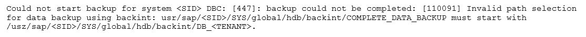

# AWS PAS 01

1. A global enterprise is running SAP ERP Central Component (SAP ECC) workloads on Oracle in an on-premises environment.  The enterprise plans to migrate to SAP S/4HANA on AWS.The enterprise recently acquired two other companies. One of the acquired companies is running SAP ECC on Oracle as its ERP system. The other acquired company is running an ERP system that is not from SAP. The enterprise wants to consolidate the three ERP systems into one ERP system on SAP S/4HANA on AWS. Not all the data from the acquired companies needs to be migrated to the final ERP system. The enterprise needs to complete this migration with a solution that minimizes cost and maximizes operational efficiency. Which solution will meet these requirements?
   - [ ] A. Perform a lift-and-shift migration of all the systems to AWS. Migrate the ERP system that is not from SAP to SAP ECC. Convert all three systems to SAP S/4HANA by using SAP Software Update Manager (SUM) Database Migration Option (DMO). Consolidate all three SAP S/4HANA systems into a final SAP S/4HANA system. Decommission the other systems.
   - [ ] B. Perform a lift-and-shift migration of all the systems to AWS. Migrate the enterprise's initial system to SAP HANA, and then perform a conversion to SAP S/4HANA. Consolidate the two systems from the acquired companies with this SAP S/4HANA system by using the Selective Data Transition approach with SAP Data Management and Landscape Transformation (DMLT).
   - [ ] C. Use SAP Software Update Manager (SUM) Database Migration Option (DMO) with System Move to re-architect the enterprise’s initial system to SAP S/4HANA and to change the platform to AWS. Consolidate the two systems from the acquired companies with this SAP S/4HANA system by using the Selective Data Transition approach with SAP Data Management and Landscape Transformation (DMLT).
   - [ ] D. Use SAP Software Update Manager (SUM) Database Migration Option (DMO) with System Move to re-architect all the systems to SAP S/4HANA and to change the platform to AWS. Consolidate all three SAP S/4HANA systems into a final SAP S/4HANA system. Decommission the other systems..

   <details>
      <summary>Answer</summary>

      C.
      A and D are wrong as one of the system is non-sap and DMP can not be used.
      B gives the expected end result but C is more cost effective and efficient approach.

   </details>

2. A global retail company is running its SAP landscape on AWS. Recently, the company made changes to its SAP Web Dispatcher architecture. The company added an additional SAP Web Dispatcher for high availability with an Application Load Balancer (ALB) to balance the load between the two SAP Web Dispatchers. When users try to access SAP through the ALB, the system is reachable. However, the SAP backend system is showing an error message. An investigation reveals that the issue is related to SAP session handling and distribution of requests. The company confirmed that the system was working as expected with one SAP Web Dispatcher. The company replicated the configuration of that SAP Web Dispatcher to the new SAP Web Dispatcher.How can the company resolve the error?
   - [ ] A. Maintain persistence by using session cookies. Enable session stickiness (session affinity) on the SAP Web Dispatchers by setting the wdisp/HTTP/esid_support parameter to True.
   - [ ] B. Maintain persistence by using session cookies. Enable session stickiness (session affinity) on the ALB.
   - [ ] C. Turn on host-based routing on the ALB to route traffic between the SAP Web Dispatchers.
   - [ ] D. Turn on URL-based routing on the ALB to route traffic to the application based on URL.

   <details>
      <summary>Answer</summary>

      B.

   </details>

3. A company hosts its SAP NetWeaver workload on SAP HANA in the AWS Cloud. The SAP NetWeaver application is protected by a cluster solution that uses Red Hat Enterprise Linux. High Availability Add-On. The cluster solution uses an overlay IP address to ensure that the high availability cluster is still accessible during failover scenarios.An SAP solutions architect needs to facilitate the network connection to this overlay IP address from multiple locations. These locations include more than 25 VPCs, other AWS Regions, and the on-premises environment. The company already has set up an AWS Direct Connect connection between the on-premises environment and AWS. What should the SAP solutions architect do to meet these requirements in the MOST scalable manner?
   - [ ] A. Use VPC peering between the VPCs to route traffic between them.
   - [ ] B. Use AWS Transit Gateway to connect the VPCs and on-premises networks together.
   - [ ] C. Use a Network Load Balancer to route connections to various targets within VPCs.
   - [ ] D. Deploy a Direct Connect gateway to connect the Direct Connect connection over a private VIF to one or more VPCs in any accounts.
   <details>
      <summary>Answer</summary>

      B.

   </details>

4. A company is implementing SAP HANA on AWS. According to the company’s security policy, SAP backups must be encrypted. Only authorized team members can have the ability to decrypt the SAP backups. What is the MOST operationally efficient solution that meets these requirements?
   - [ ] A. Configure AWS Backint Agent for SAP HANA to create SAP backups in an Amazon S3 bucket. After a backup is created, encrypt the backup by using client-side encryption. Share the encryption key with authorized team members only.
   - [ ] B. Configure AWS Backint Agent for SAP HANA to use AWS Key Management Service (AWS KMS) for SAP backups. Create a key policy to grant decryption permission to authorized team members only.
   - [ ] C. Configure AWS Storage Gateway to transfer SAP backups from a file system to an Amazon S3 bucket. Use an S3 bucket policy to grant decryption permission to authorized team members only.
   - [ ] D. Configure AWS Backint Agent for SAP HANA to use AWS Key Management Service (AWS KMS) for SAP backups. Grant object ACL decryption permission to authorized team members only.

   <details>
      <summary>Answer</summary>

      B.

   </details>

5. A data analysis company has two SAP landscapes that consist of sandbox, development, QA, pre-production, and production servers. One landscape is on Windows, and the other landscape is on Red Hat Enterprise Linux. The servers reside in a room in a building that other tenants share. An SAP solutions architect proposes to migrate the SAP applications to AWS. The SAP solutions architect wants to move the production backups to AWS and wants to make the backups highly available to restore in case of unavailability of an on-premises server. Which solution will meet these requirements MOST cost-effectively?
   - [ ] A. Take a backup of the production servers. Implement an AWS Storage Gateway Volume Gateway. Create file shares by using the Storage Gateway Volume Gateway. Copy the backup files to the file shares through NFS and SMB.
   - [ ] B. Take a backup of the production servers. Send those backups to tape drives. Implement an AWS Storage Gateway Tape Gateway. Send the backups to Amazon S3 Standard-Infrequent Access (S3 Standard-IA) through the S3 console. Move the backups immediately to S3 Glacier Deep Archive.
   - [ ] C. Implement a third-party tool to take images of the SAP application servers and database server. Take regular snapshots at 1-hour intervals. Send the snapshots to Amazon S3 Glacier directly through the S3 Glacier console. Store the same images in different S3 buckets in different AWS Regions.
   - [ ] D. Take a backup of the production servers. Implement an Amazon S3 File Gateway. Create file shares by using the S3 File Gateway. Copy the backup files to the file shares through NFS and SMB. Map backup files directly to Amazon S3. Configure an S3 Lifecycle policy to send the backup files to S3 Glacier based on the company’s data retention policy.

   <details>
      <summary>Answer</summary>

      D.
      - A. AWS Storage Gateway Volume Gateway: This would be effective for disaster recovery, but it might be more expensive due to the volume gateway costs and egress charges.
      - B. AWS Storage Gateway Tape Gateway and S3 Standard-IA and S3 Glacier Deep Archive: Using tape backups can be quite cost-effective for long-term storage. However, the retrieval time from Glacier Deep Archive is long and might not meet the high-availability requirement. Moreover, tape drives have an upfront hardware cost.
      - C. Third-party tool with regular snapshots to S3 Glacier: This could be costly due to the frequency of the snapshots (every 1-hour). Also, sending data directly to S3 Glacier means that in case you need to quickly restore the data, you might have to wait a longer time for retrieval.
      - D. Amazon S3 File Gateway with Lifecycle Policies: This option allows for easy backup restoration and could be the most cost-effective. Data can be initially stored in S3 (highly available and quickly accessible) and can be moved to Glacier based on a retention policy. This meets the requirements of high availability for restoration as well as cost-effectiveness over the long term.

   </details>

6. A company’s SAP basis team is responsible for database backups in Amazon S3. The company frequently needs to restore the last 3 months of backups into the pre-production SAP system to perform tests and analyze performance. Previously, an employee accidentally deleted backup files from the S3 bucket. The SAP basis team wants to prevent accidental deletion of backup files in the future. Which solution will meet these requirements?
   - [ ] A. Create a new resource-based policy that prevents deletion of the S3 bucket.
   - [ ] B. Enable versioning and multi-factor authentication (MFA) on the S3 bucket.
   - [ ] C. Create signed cookies for the backup files in the S3 bucket. Provide the signed cookies to authorized users only.
   - [ ] D. Apply an S3 Lifecycle policy to move the backup files immediately to S3 Glacier.

    <details>
      <summary>Answer</summary>

      B.

   </details>

7. A company wants to run SAP HANA on AWS in the eu-central-1 Region. The company must make the SAP HANA system highly available by using SAP HANA system replication. In addition, the company must create a disaster recovery (DR) solution that uses SAP HANA system replication in the eu-west-1 Region. As prerequisites, the company has confirmed that Inter-AZ latency is less than 1 ms and that Inter-Region latency is greater than 1 ms. Which solutions will meet these requirements? (Choose two.)
   - [ ] A. Install the tier 1 primary system and the tier 2 secondary system in eu-central-1. Configure the tier 1 system in Availability Zone 1. Configure the tier 2 system in Availability Zone 2. Configure SAP HANA system replication between tier 1 and tier 2 by using ASYNC replication mode. Install the DR tier 3 secondary system in eu-west-1 by using SYNC replication mode.
   - [ ] B. Install the tier 1 primary system and the tier 2 secondary system in eu-central-1. Configure the tier 1 system in Availability Zone 1. Configure the tier 2 system in Availability Zone 2. Configure SAP HANA system replication between tier 1 and tier 2 by using SYNC replication mode. Install the DR tier 3 secondary system in eu-west-1 by using ASYNC replication mode.
   - [ ] C. Install the tier 1 primary system and the tier 2 secondary system in eu-central-1. Configure the tier 1 system in Availability Zone 1. Configure the tier 2 system in Availability Zone 2. Configure SAP HANA system replication between tier 1 and tier 2 by using SYNC replication mode. Install the DR tier 3 secondary system in eu-west-1. Store daily backups from tier 1 in an Amazon S3 bucket in eu-central-1. Use S3 Cross-Region Replication to copy the daily backups to eu-west-1, where they can be restored if needed.
   - [ ] D. Install the tier 1 primary system in eu-central-1. Install the tier 2 secondary system and the DR tier 3 secondary system in eu-west-1. Configure the tier 2 system in Availability Zone 1. Configure the tier 3 system in Availability Zone 2. Configure SAP HANA system replication between all tiers by using ASYNC replication mode.
   - [ ] E. Install the tier 1 primary system and the tier 2 secondary system in eu-central-1. Configure the tier 1 system in Availability Zone 1. Configure the tier 2 system in Availability Zone 2. Configure SAP HANA system replication between tier 1 and tier 2 by using SYNCMEM replication mode. Install the DR tier 3 secondary system in eu-west-1 by using ASYNC replication mode.

    <details>
      <summary>Answer</summary>

      BE.
      - This option meets the need for high availability within the same region with SYNC replication and disaster recovery in another region with ASYNC replication.
      - SYNCMEM is an advanced variation of SYNC replication and works well for high availability within the same region. Disaster recovery in another region is accomplished using ASYNC replication.

   </details>

8. A company is running an SAP ERP Central Component (SAP ECC) system on an SAP HANA database that is 10 TB in size. The company is receiving notifications about long-running database backups every day. The company uses AWS Backint Agent for SAP HANA (AWS Backint agent) on an Amazon EC2 instance to back up the database. An SAP NetWeaver administrator needs to troubleshoot the problem and propose a solution. Which solution will help resolve this problem?
   - [ ] A. Ensure that AWS Backint agent is configured to send the backups to an Amazon S3 bucket over the internet. Ensure that the EC2 instance is configured to access the internet through a NAT gateway.
   - [ ] B. Check the UploadChannelSize parameter for AWS Backint agent. Increase this value in the aws-backint-agent-config.yaml configuration file based on the EC2 instance type and storage configurations.
   - [ ] C. Check the MaximumConcurrentFilesForRestore parameter for AWS Backint agent. Increase the parameter from 5 to 10 by using the aws-backint-agent-config.yaml configuration file.
   - [ ] D. Ensure that the backups are compressed. If necessary, configure AWS Backint agent to compress the backups and send them to an Amazon S3 bucket.

   <details>
      <summary>Answer</summary>

      B.

   </details>

9. A company wants to migrate its SAP workloads to AWS from another cloud provider. The company’s landscape consists of SAP S/4HANA, SAP BW/4HANA, SAP Solution Manager, and SAP Web Dispatcher. SAP Solution Manager is running on SAP HANA. The company wants to change the operating system from SUSE Linux Enterprise Server to Red Hat Enterprise Linux as a part of this migration. The company needs a solution that results in the least possible downtime for the SAP S/4HANA and SAP BW/4HANA systems. Which migration solution will meet these requirements?
   - [ ] A. Use SAP Software Provisioning Manager to perform a system export/import for SAP S/4HANA, SAP BW/4HANA, SAP Solution Manager, and SAP Web Dispatcher.
   - [ ] B. Use backup and restore for SAP S/4HANA, SAP BW/4HANA, and SAP Solution Manager. Reinstall SAP Web Dispatcher on AWS with the necessary configuration.
   - [ ] C. Use backup and restore for SAP S/4HANA and SAP BW/4HANA. Use SAP Software Provisioning Manager to perform a system export/import for SAP Solution Manager. Reinstall SAP Web Dispatcher on AWS with the necessary configuration.
   - [ ] D. Use SAP HANA system replication to replicate the data between the source system and the target AWS system for SAP S/4HANA and SAP BW/4HANA. Use SAP Software Provisioning Manager to perform a system export/import for SAP Solution Manager. Reinstall SAP Web Dispatcher on AWS with the necessary configuration.

   <details>
      <summary>Answer</summary>

      D.
      - **A. Use SAP Software Provisioning Manager for System Export/Import:** This approach involves significant downtime, as you need to export/import for all the systems. This would likely not meet the "least possible downtime" requirement.
      - **B. Use Backup and Restore for all Systems:** This is generally a safe approach, but the restoration process can be time-consuming, especially for large data sets in SAP S/4HANA and SAP BW/4HANA, not to mention adjusting for the new operating system (from SUSE to Red Hat). It may not meet the "least possible downtime" requirement.
      - **C. Mixed Approach with Backup/Restore and System Export/Import:** This approach has the downside of still requiring potentially significant downtime for SAP S/4HANA and SAP BW/4HANA during backup and restore.
      - **D. Use SAP HANA System Replication and Software Provisioning Manager:** System replication for SAP HANA is specifically designed to minimize downtime. It replicates changes in real-time from the source system to the target system, allowing for a quicker cutover. Meanwhile, Software Provisioning Manager can handle the export/import for SAP Solution Manager, and you can reinstall Web Dispatcher on AWS.

   </details>

10. A company is running an SAP on Oracle system on IBM Power architecture in an on-premises data center. The company wants to migrate the SAP system to AWS. The Oracle database is 15 TB in size. The company has set up a 100 Gbps AWS Direct Connect connection to AWS from the on-premises data center. Which solution should the company use to migrate the SAP system MOST quickly?
    - [ ] A. Before the migration window, build a new installation of the SAP system on AWS by using SAP Software Provisioning Manager. During the migration window, export a copy of the SAP system and database by using the heterogeneous system copy process and R3load. Copy the output of the SAP system files to AWS through the Direct Connect connection. Import the SAP system to the new SAP installation on AWS. Switch over to the SAP system on AWS.
    - [ ] B. Before the migration window, build a new installation of the SAP system on AWS by using SAP Software Provisioning Manager. Back up the Oracle database by using native Oracle tools. Copy the backup of the Oracle database to AWS through the Direct Connect connection. Import the Oracle database to the SAP system on AWS. Configure Oracle Data Guard to begin replicating on-premises database log changes from the SAP system to the new AWS system. During the migration window, use Oracle to replicate any remaining changes to the Oracle database hosted on AWS. Switch over to the SAP system on AWS.
    - [ ] C. Before the migration window, build a new installation of the SAP system on AWS by using SAP Software Provisioning Manager. Create a staging Oracle database on premises to perform Cross Platform Transportable Tablespace (XTTS) conversion on the Oracle database. Take a backup of the converted staging database. Copy the converted backup to AWS through the Direct Connect connection. Import the Oracle database backup to the SAP system on AWS. Take regularly scheduled incremental backups and XTTS conversions of the staging database. Transfer these backups and conversions to the AWS target database. During the migration window, perform a final incremental Oracle backup. Convert the final Oracle backup by using XTTS. Replay the logs in the target Oracle database hosted on AWS. Switch over to the SAP system on AWS.
    - [ ] D. Before the migration window, launch an appropriately sized Amazon EC2 instance on AWS to receive the migrated SAP database. Create an AWS Server Migration Service (AWS SMS) job to take regular snapshots of the on-premises Oracle hosts. Use AWS SMS to copy the snapshot as an AMI to AWS through the Direct Connect connection. Create a new SAP on Oracle system by using the migrated AMI. During the migration window, take a final incremental SMS snapshot and copy the snapshot to AWS. Restart the SAP system by using the new up-to-date AMI. Switch over to the SAP system on AWS.
    <details>
       <summary>Answer</summary>

       C.
       - Option A: The heterogeneous system copy process and R3load may require a long time for a 15 TB database, and this could extend the migration window. This approach does not support incremental backups or changes, making it less ideal for the MOST quick migration.
       - Option B: Backing up the Oracle database and transferring it via Direct Connect is a better option, especially with Data Guard for log replication. This minimizes the amount of data that needs to be transferred during the migration window, allowing a quicker switch-over. However, backups and restores of very large databases can be time-consuming.
       - Option C: Using XTTS (Cross Platform Transportable Tablespace) could offer more efficiency in the migration process. The regular incremental backups and XTTS conversions reduce the amount of data to be transferred during the migration window. This should technically provide for a quicker switchover, albeit with a more complex setup.
       - Option D: AWS SMS is generally used for migrating VMs, but it's not optimized for large database migrations, and taking regular snapshots could result in a lot of additional data transfer and storage costs.
       Given that the primary concern is the "MOST quick" migration and the setup includes a 100 Gbps AWS Direct Connect connection, Option C is probably the best choice. This option minimizes the data that needs to be transferred during the critical migration window by employing incremental backups and XTTS conversions, thus enabling the most rapid switchover to the AWS system. It also ensures data integrity through the Oracle database backup process, making it a robust choice.

    </details>

11. An SAP solutions architect is designing an SAP HANA scale-out architecture for SAP Business Warehouse (SAP BW) on SAP HANA on AWS. The SAP solutions architect identifies the design as a three-node scale-out deployment of xte.32xiarge Amazon EC2 instances. The SAP solutions architect must ensure that the SAP HANA scale-out nodes can achieve the low-latency and high-throughput network performance that are necessary for node-to-node communication. Which combination of steps should the SAP solutions architect take to meet these requirements? (Choose two.)
    - [ ] A. Create a cluster placement group. Launch the instances into the cluster placement group.
    - [ ] B. Create a spread placement group. Launch the instances into the spread placement group.
    - [ ] C. Create a partition placement group. Launch the instances into the partition placement group.
    - [ ] D. Based on the operating system version, verify that enhanced networking is enabled on all the nodes.
    - [ ] E. Switch to a different instance family that provides network throughput that is greater than 25 Gbps.

    <details>
       <summary>Answer</summary>

       AD.

    </details>

12. A company needs to migrate its critical SAP workloads from an on-premises data center to AWS. The company has a few source production databases that are 10 TB or more in size. The company wants to minimize the downtime for this migration. As part of the proof of concept, the company used a low-speed, high-latency connection between its data center and AWS. During the actual migration, the company wants to maintain a consistent connection that delivers high bandwidth and low latency. The company also wants to add a layer of connectivity resiliency. The backup connectivity does not need to be as fast as the primary connectivity.An SAP solutions architect needs to determine the optimal network configuration for data transfer. The solution must transfer the data with minimum latency.Which configuration will meet these requirements?
    - [ ] A. Set up one AWS Direct Connect connection for connectivity between the on-premises data center and AWS. Add an AWS Site-to-Site VPN connection as a backup to the Direct Connect connection.
    - [ ] B. Set up an AWS Direct Connect gateway with multiple Direct Connect connections that use a link aggregation group (LAG) between the on-premises data center and AWS.
    - [ ] C. Set up Amazon Elastic File System (Amazon EFS) file system storage between the on-premises data center and AWS. Configure a cron job to copy the data into this EFS mount. Access the data in the EFS file system from the target environment.
    - [ ] D. Set up two redundant AWS Site-to-Site VPN connections for connectivity between the on-premises data center and AWS.

    <details>
       <summary>Answer</summary>

       A.

    </details>

13. A company wants to migrate its SAP ERP landscape to AWS. The company will use a highly available distributed deployment for the new architecture. Clients will access SAP systems from a local data center through an AWS Site-to-Site VPN connection that is already in place. An SAP solutions architect needs to design the network access to the SAP production environment. Which configuration approaches will meet these requirements? (Choose two.)
    - [ ] A. For the ASCS instance, configure an overlay IP address that is within the production VPC CIDR range. Create an AWS Transit Gateway. Attach the VPN to the transit gateway. Use the transit gateway to route the communications between the local data center and the production VPC. Create a static route on the production VPC to route traffic that is directed to the overlay IP address to the ASCS instance.
    - [ ] B. For the ASCS instance, configure an overlay IP address that is outside the production VPC CIDR range. Create an AWS Transit Gateway. Attach the VPN to the transit gateway. Use the transit gateway to route the communications between the local data center and the production VPC. Create a static route on the production VPC to route traffic that is directed to the overlay IP address to the ASCS instance.
    - [ ] C. For the ASCS instance, configure an overlay IP address that is within the production VPC CIDR range. Create a target group that points to the overlay IP address. Create a Network Load Balancer, and register the target group. Create a static route on the production VPC to route traffic that is directed to the overlay IP address to the ASCS instance.
    - [ ] D. For the ASCS instance, configure an overlay IP address that is outside the production VPC CIDR range. Create a target group that points to the overlay IP address. Create a Network Load Balancer, and register the target group. Create a static route on the production VPC to route traffic that is directed to the overlay IP address to the ASCS instance.
    - [ ] E. For the ASCS instance, configure an overlay IP address that is outside the production VPC CIDR range. Create a target group that points to the overlay IP address. Create an Application Load Balancer, and register the target group. Create a static route on the production VPC to route traffic that is directed to the overlay IP address to the ASCS instance.

    <details>
       <summary>Answer</summary>

       BD.

    </details>

14. A company is running an SAP HANA database on AWS. The company is running AWS Backint Agent for SAP HANA (AWS Backint agent) on an Amazon EC2 instance. AWS Backint agent is configured to back up to an Amazon S3 bucket. The backups are failing with an AccessDenied error in the AWS Backint agent log file. What should an SAP basis administrator do to resolve this error?
    - [ ] A. Assign execute permissions at the operating system level for the AWS Backint agent binary and for AWS Backint agent.
    - [ ] B. Assign an IAM role to an EC2 instance. Attach a policy to the IAM role to grant access to the target S3 bucket.
    - [ ] C. Assign the correct Region ID for the S3BucketAwsRegion parameter in AWS Backint agent for the SAP HANA configuration file.
    - [ ] D. Assign the value for the EnableTagging parameter in AWS Backint agent for the SAP HANA configuration file.

    <details>
       <summary>Answer</summary>

       B.

    </details>

15. A company is starting a new project to implement an SAP landscape with multiple accounts that belong to multiple teams in the us-east-2 Region. These teams include procurement, finance, sales, and human resources. An SAP solutions architect has started designing this new landscape and the AWS account structures. The company wants to use automation as much as possible. The company also wants to secure the environment, implement federated access to accounts, centralize logging, and establish cross-account security audits. In addition, the company’s management team needs to receive a top-level summary of policies that are applied to the AWS accounts. What should the SAP solutions architect do to meet these requirements?
    - [ ] A. Use AWS CloudFormation StackSets to apply SCPs to multiple accounts in multiple Regions. Use an Amazon CloudWatch dashboard to check the applied policies in the accounts.
    - [ ] B. Use an AWS Elastic Beanstalk blue/green deployment to create IAM policies and apply them to multiple accounts together. Use an Amazon CloudWatch dashboard to check the applied policies in the accounts.
    - [ ] C. Implement guardrails by using AWS CodeDeploy and AWS CodePipeline to deploy SCPs into each account. Use the CodePipeline deployment dashboard to check the applied policies in the accounts.
    - [ ] D. Apply SCPs through AWS Control Tower. Use the AWS Control Tower integrated dashboard to check the applied policies in the accounts.
    <details>
       <summary>Answer</summary>

       D.

    </details>

16. A company is running its SAP workloads on premises and needs to migrate the workloads to AWS. All the workloads are running on SUSE Linux Enterprise Server and Oracle Database. The company’s landscape consists of SAP ERP Central Component (SAP ECC), SAP Business Warehouse (SAP BW), and SAP NetWeaver systems. The company has a dedicated AWS Direct Connect connection between its on-premises environment and AWS. The company needs to migrate the systems to AWS with the least possible downtime. Which migration solution will meet these requirements?
    - [ ] A. Use SAP Software Provisioning Manager to perform an export of the systems. Copy the export to Amazon S3. Use SAP Software Provisioning Manager to perform an import of the systems to SUSE Linux Enterprise Server and Oracle Database on AWS.
    - [ ] B. Use SAP Software Provisioning Manager to perform parallel export/import of the systems to migrate the systems to SUSE Linux Enterprise Server and Oracle Database on AWS.
    - [ ] C. Use SAP Software Provisioning Manager to perform parallel export/import of the systems to migrate the systems to Oracle Enterprise Linux and Oracle Database on AWS.
    - [ ] D. Use SAP Software Provisioning Manager to perform an export of the systems. Copy the export to Amazon S3. Use SAP Software Provisioning Manager to perform an import of the systems to Oracle Enterprise Linux and Oracle Database on AWS.

    <details>
       <summary>Answer</summary>

       C. Because Oracle DB can not run on SUSE Linux Enterprise Server on AWS. It can only run on Oracle Enterprise Linux on AWS.

    </details>

17. A company is designing a disaster recovery (DR) strategy for an SAP HANA database that runs on an Amazon EC2 instance in a single Availability Zone. The company can tolerate a long RTO and an RPO greater than zero if it means that the company can save money on its DR process The company has configured an Amazon CloudWatch alarm to automatically recover the EC2 instance if the instance experiences an unexpected issue. The company has set up AWS Backint Agent for SAP HANA to save the backups into Amazon S3. What is the MOST cost-effective DR option for the company's SAP HANA database?
    - [ ] A. Set up AWS CloudFormation to automatically launch a new EC2 instance for the SAP HANA database in a second Availability Zone from backups that are stored in Amazon S3. When the SAP HANA database is operational, perform a database restore by using the standard SAP HANA restore process.
    - [ ] B. Launch a secondary EC2 instance for the SAP HANA database on a less powerful EC2 instance type in a second Availability Zone. Configure SAP HANA system replication with the preload option turned off.
    - [ ] C. Launch a secondary EC2 instance for the SAP HANA database on an equivalent EC2 instance type in a second Availability Zone. Configure SAP HANA system replication with the preload option turned on.
    - [ ] D. Set up AWS CloudFormation to automatically launch a new EC2 instance for the SAP HANA database in a second Availability Zone from backups that are stored in Amazon Elastic Block Store (Amazon EBS). When the SAP HANA database is operational, perform a database restore by using the standard SAP HANA restore process.

    <details>
       <summary>Answer</summary>

       A.

    </details>

18. A company is using a multi-account strategy for SAP HANA and SAP BW/4HANA instances across development, QA, and production systems in the same AWS Region. Each system is hosted in its own VPC. The company needs to establish cross-VPC communication between the SAP systems. The company might add more SAP systems in the future. The company must create connectivity across the SAP systems and hundreds of AWS accounts. The solution must maximize scalability and reliability. Which solution will meet these requirements?
    - [ ] A. Create an AWS Transit Gateway in a central networking account. Attach the transit gateway to the AWS accounts. Set up routing and a network ACL to establish communication.
    - [ ] B. Set up VPC peering between the accounts. Configure routing in each VPC to use the VPC peering links.
    - [ ] C. Create a transit VPC that uses the hub-and-spoke model. Set up routing to use the transit VPC for communication between the SAP systems.
    - [ ] D. Create a VPC link for each SAP system. Use the VPC links to connect the SAP systems.

    <details>
       <summary>Answer</summary>

       A.

    </details>

19. A company is planning to deploy a new SAP NetWeaver ABAP system on AWS with an Oracle database that runs on an Amazon EC2 instance. The EC2 instance uses a Linux-based operating system. The company needs a database storage solution that provides flexibility to adjust the IOPS regardless of the allocated storage size. Which solution will meet these requirements MOST cost-effectively?
    - [ ] A. General Purpose SSD (gp3) Amazon Elastic Block Store (Amazon EBS) volumes
    - [ ] B. Amazon Elastic File System (Amazon EFS) Standard-Iinfrequent Access (Standard-IA) storage class
    - [ ] C. Amazon FSx for Windows File Server
    - [ ] D. Provisioned IOPS SSD (io2) Amazon Elastic Block Store (Amazon EBS) volumes

    <details>
       <summary>Answer</summary>

       A.

    </details>

20. A company is using SAP NetWeaver with Java on AWS. The company has updated its generation of Amazon EC2 instances to the most recent generation of EC2 instances. When the company tries to start SAP, the startup fails. The log indicates that the SAP license expired or is not valid. What is the reason for this issue?
    - [ ] A. The instance ID changed as part of the EC2 generation change.
    - [ ] B. The instance’s hypervisor changed from Xen to Nitro.
    - [ ] C. The SAP Java Virtual Machine (SAP JVM) is not compatible with the new instance type.
    - [ ] D. An EC2 generation change is not supported for SAP Java-based systems.

    <details>
       <summary>Answer</summary>

       B.

    </details>

21. A company’s basis administrator is planning to deploy SAP on AWS in Linux. The basis administrator must set up the proper storage to store SAP HANA data and log volumes. Which storage options should the basis administrator choose to meet these requirements? (Choose two.)
    - [ ] A. Amazon Elastic Block Store (Amazon EBS) Throughput Optimized HDD (st1)
    - [ ] B. Amazon Elastic Block Store (Amazon EBS) Provisioned OPS SSD (io1, io2)
    - [ ] C. Amazon S3
    - [ ] D. Amazon Elastic File System (Amazon EFS)
    - [ ] E. Amazon Elastic Block Store (Amazon EBS) General Purpose SSD (gp2, gp3)

    <details>
       <summary>Answer</summary>

       BE. <https://docs.aws.amazon.com/sap/latest/sap-hana/hana-ops-storage-config.html>

    </details>

22. A company has deployed a highly available SAP NetWeaver system on SAP HANA into a VPC. The system is distributed across multiple Availability Zones within a single AWS Region. SAP NetWeaver is running on SUSE Linux Enterprise Server for SAP. SUSE Linux Enterprise High Availability Extension is configured to protect SAP ASCS and ERS instances and uses the overlay IP address concept. The SAP shared files /sapmnt and /usr/sap/trans are hosted on an Amazon Elastic File System (Amazon EFS) file system. The company needs a solution that uses already-existing private connectivity to the VPC. The SAP NetWeaver system must be accessible through the SAP GUI client tool. Which solutions will meet these requirements? (Choose two.)
    - [ ] A. Deploy an Application Load Balancer. Configure the overlay IP address as a target.
    - [ ] B. Deploy a Network Load Balancer. Configure the overlay IP address as a target.
    - [ ] C. Use an Amazon Route 53 private zone. Create an A record that has the overlay IP address as a target.
    - [ ] D. Use AWS Transit Gateway. Configure the overlay IP address as a static route in the transit gateway route table. Specify the VPC as a target.
    - [ ] E. Use a NAT gateway. Configure the overlay IP address as a target.
  
    <details>
       <summary>Answer</summary>

       BC.
       - A. Deploy an Application Load Balancer. Configure the overlay IP address as a target. Application Load Balancers are primarily designed for HTTP/HTTPS traffic and are not well-suited for SAP GUI, which doesn't use these protocols.
       - B. Deploy a Network Load Balancer. Configure the overlay IP address as a target. Network Load Balancers are capable of handling TCP traffic and are well-suited for use cases where low latency and high throughput are required, which fits the SAP GUI client tool requirements. Configuring the overlay IP address as a target would allow the NLB to distribute incoming SAP GUI traffic across multiple Availability Zones.
       - C. Use an Amazon Route 53 private zone. Create an A record that has the overlay IP address as a target. Using Amazon Route 53 with a private zone would allow you to create DNS entries that resolve to private IP addresses within your VPC. This would enable access via the SAP GUI client tool through a more user-friendly DNS name rather than an IP address. You can create an A record with the overlay IP, making it possible to use already-existing private connectivity.
       - D. Use AWS Transit Gateway. Configure the overlay IP address as a static route in the transit gateway route table. Specify the VPC as a target. AWS Transit Gateway is generally used for connecting multiple VPCs and on-premises networks. Adding a static route for the overlay IP does not specifically facilitate SAP GUI client access and would be more applicable for routing concerns between multiple networks.
       - E. Use a NAT gateway. Configure the overlay IP address as a target. NAT Gateways are used to allow resources in a private subnet to initiate outbound traffic to the Internet or other AWS services, but they don't typically handle incoming traffic initiated from external clients, like the SAP GUI client tool, in the way required here.

    </details>

23. A company is planning to move all its SAP applications to Amazon EC2 instances in a VPC. Recently, the company signed a multiyear contract with a payroll software-as-a-service (SaaS) provider. Integration with the payroll SaaS solution is available only through public web APIs. Corporate security guidelines state that all outbound traffic must be validated against an allow list. The payroll SaaS provider provides only fully qualified domain name (FQDN) addresses and no IP addresses or IP address ranges. Currently, an on-premises firewall appliance filters FQDNs. The company needs to connect an SAP Process Orchestration (SAP PO) system to the payroll SaaS provider. What must the company do on AWS to meet these requirements?
    - [ ] A. Add an outbound rule to the security group of the SAP PO system to allow the FQDN of the payroll SaaS provider and deny all other outbound traffic.
    - [ ] B. Add an outbound rule to the network ACL of the subnet that contains the SAP PO system to allow the FQDN of the payroll SaaS provider and deny all other outbound traffic.
    - [ ] C. Add an AWS WAF web ACL to the VPAdd an outbound rule to allow the SAP PO system to connect to the FQDN of the payroll SaaS provider.
    - [ ] D. Add an AWS Network Firewall firewall to the VPC. Add an outbound rule to allow the SAP PO system to connect to the FQDN of the payroll SaaS provider.

    <details>
       <summary>Answer</summary>

       D: FQDN filtering can be achieved only through Firewall

    </details>

24. A company is planning to migrate its on-premises SAP application to AWS. The application runs on VMware vSphere. The SAP ERP Central Component (SAP ECC) server runs on an IBM Db2 database that is 2 TB in size. The company wants to migrate the database to SAP HANA. Which migration strategy will meet these requirements?
    - [ ] A. Use AWS Application Migration Service (CloudEndure Migration).
    - [ ] B. Use SAP Software Update Manager (SUM) Database Migration Option (DMO) with System Move.
    - [ ] C. Use AWS Server Migration Service (AWS SMS).
    - [ ] D. Use AWS Database Migration Service (AWS DMS).

    <details>
       <summary>Answer</summary>

       B.
       - **AWS Application Migration Service (CloudEndure Migration):** This is designed for lift-and-shift migrations where the application architecture remains essentially the same. CloudEndure would not natively help you migrate from IBM Db2 to SAP HANA.
       - **SAP Software Update Manager (SUM) Database Migration Option (DMO) with System Move:** This tool is designed specifically to handle complex SAP system migrations, including changing the database. SUM DMO can take care of upgrading SAP components and migrating the database at the same time.
       - **AWS Server Migration Service (AWS SMS):** AWS SMS helps in automating the migration of existing VMware vSphere-based applications to AWS, but it doesn't inherently help with the database transformation from IBM Db2 to SAP HANA.
       - **AWS Database Migration Service (AWS DMS):** While this service is useful for database migrations, it is not optimized for a specialized application like SAP and may not support a migration from IBM Db2 to SAP HANA.

    </details>

25. A company hosts multiple SAP applications on Amazon EC2 instances in a VPC. While monitoring the environment, the company notices that multiple port scans are attempting to connect to SAP portals inside the VPC. These port scans are originating from the same IP address block. The company must deny access to the VPC from all the offending IP addresses for the next 24 hours. Which solution will meet this requirement?
    - [ ] A. Modify network ACLs that are associated with all public subnets in the VPC to deny access from the IP address block.
    - [ ] B. Add a rule in the security group of the EC2 instances to deny access from the IP address block.
    - [ ] C. Create a policy in AWS Identity and Access Management (IAM) to deny access from the IP address block.
    - [ ] D. Configure the firewall in the operating system of the EC2 instances to deny access from the IP address block.
    <details>
       <summary>Answer</summary>

       A.

    </details>

26. A company has deployed SAP workloads on AWS. The AWS Data Provider for SAP is installed on the Amazon EC2 instance where the SAP application is running. An SAP solutions architect has attached an IAM role to the EC2 instance with the following policy. The AWS Data Provider for SAP is not returning any metrics to the SAP application. Which change should the SAP solutions architect make to the IAM permissions to resolve this issue?

    ```json
    {
       "Version": "2012-10-17",
       "Statement": [
          {
             "Sid": "AWSDataProvider1",
             "Effect": "Allow",
             "Action": [
                "EC2:DescribeInstance",
                "EC2:DescrineVolumes"
             ],
             "Resource": "*"
          },
          {
             "Sid": "AWSDataProvider2",
             "Effect": "Allow",
             "Action": "S3:GetObject",
             "Resource": [
                "arn:aws:s3::aws-sap-data-provider/config.properties"
             ]
          }
       ]
    }
    ```

    - [ ] A. Add the cloudwatch:ListMetrics action to the policy statement with Sid AWSDataProvider1.
    - [ ] B. Add the cloudwatch:GetMetricStatistics action to the policy statement with Sid AWSDataProvider1.
    - [ ] C. Add the cloudwatch:GetMetricStream action to the policy statement with Sid AWSDataProvider1.
    - [ ] D. Add the cloudwatch:DescribeAlarmsForMetric action to the policy statement with Sid AWSDataProvider1.search and discover metadata.

    <details>
       <summary>Answer</summary>

       B. cloudwatch:GetMetricStatistics action is necessary to get metric data from CloudWatch, which will allow the data provider to collect and present the metrics to the SAP application

    </details>

27. A company wants to deploy an SAP HANA database on AWS by using AWS Launch Wizard for SAP. An SAP solutions architect needs to run a custom post-deployment script on the Amazon EC2 instance that Launch Wizard provisions. Which actions can the SAP solutions architect take to provide the post-deployment script in the Launch Wizard console? (Choose two.)
    - [ ] A. Provide the FTP URL of the script.
    - [ ] B. Provide the HTTPS URL of the script on a web server.
    - [ ] C. Provide the Amazon S3 URL of the script.
    - [ ] D. Write the script inline.
    - [ ] E. Upload the script.
    <details>
       <summary>Answer</summary>

       CE.

    </details>

28. A company is planning to move its on-premises SAP HANA database to AWS. The company needs to migrate this environment to AWS as quickly as possible. An SAP solutions architect will use AWS Launch Wizard for SAP to deploy this SAP HANA workload. Which combination of steps should the SAP solutions architect follow to start the deployment of this workload on AWS? (Choose three.)
    - [ ] A. Download the SAP HANA software.
    - [ ] B. Download the AWS CloudFormation template for the SAP HANA deployment.
    - [ ] C. Download and extract the SAP HANA software. Upload the SAP HANA software to an FTP server that Launch Wizard can access.
    - [ ] D. Upload the unextracted SAP HANA software to an Amazon S3 destination bucket. Follow the S3 file path syntax for the software in accordance with Launch Wizard recommendations.
    - [ ] E. Bring the operating system AMI by using the Bring Your Own Image (BYOI) model, or purchase the subscription for the operating system AMI from AWS Marketplace.
    - [ ] F. Create the SAP file system by using Amazon Elastic Block Store (Amazon EBS) before the deployment.

    <details>
       <summary>Answer</summary>

       ADE.

    </details>

29. A company wants to implement SAP HANA on AWS with the Multi-AZ deployment option by using AWS Launch Wizard for SAP. The solution will use SUSE Linux Enterprise High Availability Extension for the high availability deployment. An SAP solutions architect must ensure that all the prerequisites are met. The SAP solutions architect also must ensure that the user inputs to start the guided deployment of Launch Wizard are valid. Which combination of steps should the SAP solutions architect take to meet these requirements? (Choose two.)
    - [ ] A. Before starting the Launch Wizard deployment, create the underlying Amazon Elastic Block Store (Amazon EBS) volume types to use for SAP HANA data and log volumes based on the performance requirements.
    - [ ] B. Use a value for the PaceMakerTag parameter that is not used by any other Amazon EC2 instances in the AWS Region where the system is being deployed.
    - [ ] C. Ensure that the virtual hostname for the SAP HANA database that is used for the SUSE Linux Enterprise High Availability Extension configuration is not used in any other deployed accounts.
    - [ ] D. Ensure that the VirtuallPAddress parameter is outside the VPC CIDR and is not being used in the route table that is associated with the subnets where primary and secondary SAP HANA instances will be deployed.
    - [ ] E. Before starting the Launch Wizard deployment, set up the SUSE Linux Enterprise High Availability Extension network configuration and security group.

    <details>
       <summary>Answer</summary>

       BD. SLES HAE and RHEL High Availability agents require that the Pacemaker tag and the overlay IP address you provide by setting deployment parameters can be uniquely identified.
    </details>

30. A company that has SAP workloads on premises plans to migrate an SAP environment to AWS. The company is new to AWS and has no prior setup. The company has the following requirements: The application server and database server must be placed in isolated network configurations. (1) SAP systems must be accessible to the on-premises end users over the internet. (2) The cost of communications between the application server and the database server must be minimized. (3) Which combination of steps should an SAP solutions architect take to meet these requirements? (Choose two.)
    - [ ] A. Configure a Network Load Balancer for incoming connections from end users.
    - [ ] B. Set up an AWS Site-to-Site VPN connection between the company’s on-premises network and AWS.
    - [ ] C. Separate the application server and the database server by using different VPCs.
    - [ ] D. Separate the application server and the database server by using different subnets and network security groups within the same VPC.
    - [ ] E. Set up an AWS Direct Connect connection with a private VIF between the company’s on-premises network and AWS.

    <details>
       <summary>Answer</summary>

       BD.

    </details>

31. A company is running its SAP workload on AWS. The company’s security team has implemented the following requirements: (1) All Amazon EC2 instances for SAP must be SAP certified instance types. (2) Encryption must be enabled for all Amazon S3 buckets and Amazon Elastic Block Store (Amazon EBS) volumes. (3) AWS CloudTrail must be activated. (4) SAP system parameters must be compliant with business rules. (5) Detailed monitoring must be enabled for all instances. The company wants to develop an automated process to review the systems for compliance with the security team’s requirements. The process also must provide notification about any deviation from these standards. Which solution will meet these requirements?
    - [ ] A. Use AWS AppConfig to model configuration data in an AWS Systems Manager Automation runbook. Schedule this Systems Manager Automation runbook to monitor for compliance with all the requirements. Integrate AWS AppConfig with Amazon CloudWatch for notification purposes.
    - [ ] B. Use AWS Config managed rules to monitor for compliance with all the requirements. Use Amazon EventBridge (Amazon CloudWatch Events) and Amazon Simple Notification Service (Amazon SNS) for email notification when a resource is flagged as noncompliant.
    - [ ] C. Use AWS Trusted Advisor to monitor for compliance with all the requirements. Use Trusted Advisor preferences for email notification when a resource is flagged as noncompliant.
    - [ ] D. Use AWS Config managed rules to monitor for compliance with the requirements, except for the SAP system parameters. Create AWS Config custom rules to validate the SAP system parameters. Use Amazon EventBridge (Amazon CloudWatch Events) and Amazon Simple Notification Service (Amazon SNS) for email notification when a resource is flagged as noncompliant.
  
    <details>
       <summary>Answer</summary>

       D.
       - **AWS AppConfig and Systems Manager Automation:** AWS AppConfig is mostly used for application configuration. While Systems Manager can execute automation runbooks, this doesn't provide native compliance checks against AWS resources like EC2, S3, EBS, etc.
       - **AWS Config managed rules:** These can monitor AWS resource configurations, but may not support all specific SAP requirements. However, you can create custom rules to cover gaps.
       - **AWS Trusted Advisor:** This provides best practice checks but doesn't support custom checks and may not have all the necessary checks related to the specific requirements of SAP workloads.
       - **AWS Config custom rules:** You can create custom rules in AWS Config to monitor specific requirements that aren't met by AWS Config managed rules. AWS Config can also provide detailed compliance monitoring for AWS resources.
       - For notifications, Amazon EventBridge (formerly CloudWatch Events) and Amazon SNS can be used to send email notifications when a resource is flagged as non-compliant, satisfying the final requirement.

    </details>

32. A company is hosting its SAP workloads on AWS. An SAP solutions architect is designing high availability architecture for the company’s production SAP S/4HANA and SAP BW/4HANA workloads. These workloads have the following requirements: (1) Redundant SAP application servers that consist of a primary application server (PAS) and an additional application server (AAS) (2) ASCS and ERS instances that use a failover cluster (3) Database high availability with a primary DB instance and a secondary DB instance. How should the SAP solutions architect design the architecture to meet these requirements?
    - [ ] A. Deploy ASCS and ERS cluster nodes in different subnets within the same Availability Zone. Deploy the PAS instance and AAS instance in different subnets within the same Availability Zone. Deploy the primary DB instance and secondary DB instance in different subnets within the same Availability Zone. Deploy all the components in the same VPC.
    - [ ] B. Deploy ASCS and ERS cluster nodes in different subnets within the same Availability Zone. Deploy the PAS instance and AAS instance in different subnets within the same Availability Zone. Deploy the primary DB instance and secondary DB instance in different subnets within the same Availability Zone. Deploy the ASCS instance, PAS instance, and primary DB instance in one VPC. Deploy the ERS instance, AAS instance, and secondary DB instance in a different VPC.
    - [ ] C. Deploy ASCS and ERS cluster nodes in different subnets across two Availability Zones. Deploy the PAS instance and AAS instance in different subnets across two Availability Zones. Deploy the primary DB instance and secondary DB instance in different subnets across two Availability Zones. Deploy all the components in the same VPC.
    - [ ] D. Deploy ASCS and ERS cluster nodes in different subnets across two Availability Zones. Deploy the PAS instance and AAS instance in different subnets across two Availability Zones. Deploy the primary DB instance and secondary DB instance in different subnets across two Availability Zones. Deploy the ASCS instance, PAS instance, and primary DB instance in one VPC. Deploy the ERS instance, AAS instance, and secondary DB instance in a different VPC.
    <details>
       <summary>Answer</summary>

       C.
       - Option A: All components are in the same Availability Zone, which makes it susceptible to a single point of failure if the whole Availability Zone experiences an issue. This doesn't fully meet high availability requirements.
       - Option B: Similar to Option A, the components are in the same Availability Zone, and hence vulnerable to a single point of failure. Additionally, splitting them across two VPCs doesn't add any extra availability and may complicate network design and data flow.
       - Option C: Components are spread across two Availability Zones, thereby reducing the risk associated with a single point of failure. All the components are within the same VPC which makes networking simpler and efficient. This meets the requirement for high availability.
       - Option D: Although it deploys resources across two Availability Zones, it complicates the architecture by splitting components into two separate VPCs. This could complicate the network design, data transfer, and also doesn't offer additional high availability compared to Option C.

    </details>

33. A company has deployed SAP HANA in the AWS Cloud. The company needs its SAP HANA database to be highly available. An SAP solutions architect has deployed the SAP HANA database in separate Availability Zones in a single AWS Region. SUSE Linux Enterprise High Availability Extension is configured with an overlay IP address. The overlay IP resource agent has the following IAM policy, During a test of failover, the SAP solutions architect finds that the overlay IP address does not change to the secondary Availability Zone. Which change should the SAP solutions architect make in the policy statement for Sid oip1 to fix this error?

    ```json
    {
       "Version": "2012-10-17",
       "Statement": [
          {
             "Sid": "oip1",
             "Effect": "Allow",
             "Action": "EC2:AssociateRouteTable",
             "Resource": "arn:aws:ec2:us-east-1:111111111111:route-table/rtb-XYZ"
          },
          {
             "Sid": "oip2",
             "Effect": "Allow",
             "Action": "EC2:DescribeRouteTable",
             "Resource": "*"
          }
       ]
    }
    ```

    - [ ] A. Change the Action element to ec2:CreateRoute.
    - [ ] B. Change the Action element to ec2:ReplaceRoute.
    - [ ] C. Change the Action element to ec2:ReplaceRouteTableAssociation.
    - [ ] D. Change the Action element to ec2:ReplaceTransitGatewayRoute.
  
    <details>
       <summary>Answer</summary>

       B.
       In the context of an overlay IP for high availability, the purpose is usually to redirect traffic to a secondary node in the case of a failure of the primary node. This typically involves updating or replacing a route to point to the secondary node's IP address. In AWS, this could be achieved by replacing the existing route in the route table, which is accomplished using the ec2:ReplaceRoute action.

    </details>

34. A company wants to improve the RPO and RTO for its SAP disaster recovery (DR) solution by running the DR solution on AWS. The company is running SAP ERP Central Component (SAP ECC) on SAP HANA. The company has set an RPO of 15 minutes and an RTO of 4 hours. The production SAP HANA database is running on a physical appliance that has x86 architecture. The appliance has 1 TB of memory, and the SAP HANA global allocation limit is set to 768 GB. The SAP application servers are running as VMs on VMware, and they store data on an NFS file system. The company does not want to change any existing SAP HANA parameters that are related to data and log backup for its on-premises systems. What should an SAP solutions architect do to meet the DR objectives MOST cost-effectively?
    - [ ] A. For the SAP HANA database, change the log backup frequency to 5 minutes. Move the data and log backups to Amazon S3 by using the AWS CLI or AWS DataSync. Launch the SAP HANA database. For the SAP application servers, export the VMs as AMIs by using the VM Import/Export feature from AWS. For NFS file shares /sapmnt and /usr/sap/trans, establish real-time synchronization from DataSync to Amazon Elastic File System (Amazon EFS).
    - [ ] B. For the SAP HANA database, change the log backup frequency to 5 minutes. Move the data and log backups to Amazon S3 by using AWS Storage Gateway File Gateway. For the SAP application servers, export the VMs as AMIs by using the VM Import/Export feature from AWS. For NFS file shares /sapmnt and /usr/sap/trans, establish real-time synchronization from AWS DataSync to Amazon Elastic File System (Amazon EFS).
    - [ ] C. For the SAP HANA database, SAP application servers, and NFS file shares, use CloudEndure Disaster Recovery to replicate the data continuously from on premises to AWS. Use CloudEndure Disaster Recovery to launch target instances in the event of a disaster.
    - [ ] D. For the SAP HANA database, use a smaller SAP certified Amazon EC2 instance. Use SAP HANA system replication with ASYNC replication mode to replicate the data continuously from on premises to AWS. For the SAP application servers, use CloudEndure Disaster Recovery for continuous data replication. For NFS file shares /sapmnt and /usr/sap/trans, establish real-time synchronization from AWS DataSync to Amazon Elastic File System (Amazon EFS).

    <details>
       <summary>Answer</summary>

       D.
       Option D most closely aligns with the company’s need to not alter existing SAP HANA parameters while also offering a cost-effective solution tailored to each component. Using a smaller EC2 instance for the SAP HANA database can also offer cost savings. It makes use of specialized solutions for each part of the environment (database, application servers, file shares) and is therefore likely to be more cost-effective than a one-size-fits-all solution like CloudEndure for everything.

    </details>

35. A company is planning to migrate its on-premises SAP applications to AWS. The applications are based on Windows operating systems. A file share stores the transport directories and third-party application data on the network-attached storage of the company’s on-premises data center. The company’s plan is to lift and shift the SAP applications and the file share to AWS. The company must follow AWS best practices for the migration. Which AWS service should the company use to host the transport directories and third-party application data on AWS?
    - [ ] A. Amazon Elastic Block Store (Amazon EBS)
    - [ ] B. AWS Storage Gateway
    - [ ] C. Amazon Elastic File System (Amazon EFS)
    - [ ] D. Amazon FSx for Windows File Server

    <details>
       <summary>Answer</summary>

       D.

    </details>

36. A company hosts an SAP HANA database on an Amazon EC2 instance in the us-east-1 Region. The company needs to implement a disaster recovery (DR) site in the us-west-1 Region. The company needs a cost-optimized solution that offers a guaranteed capacity reservation, an RPO of less than 30 minutes, and an RTO of less than 30 minutes. Which solution will meet these requirements?
    - [ ] A. Deploy a single EC2 instance to support the secondary database in us-west-1 with additional storage. Use this secondary database instance to support QA and production. Configure the primary SAP HANA database in us-east-1 to constantly replicate the data to the secondary SAP HANA database in us-west-1 by using SAP HANA system replication with preload off. During DR, shut down the QA SAP HANA instance and restart the production services at the secondary site.
    - [ ] B. Deploy a secondary staging server on an EC2 instance in us-west-1. Use CloudEndure Disaster Recovery to replicate changes at the database level from us-east-1 to the secondary staging server on an ongoing basis. During DR, initiate cutover, increase the size of the secondary EC2 instance to match the primary EC2 instance, and start the secondary EC2 instance.
    - [ ] C. Set up the primary SAP HANA database in us-east-1 to constantly replicate the data to a secondary SAP HANA database in us-west-1 by using SAP HANA system replication with preload on. Keep the secondary SAP HANA instance as a hot standby that is ready to take over in case of failure.
    - [ ] D. Create an SAP HANA database AMI by using Amazon Elastic Block Store (Amazon EBS) snapshots. Replicate the database and log backup files from a primary Amazon S3 bucket in us-east-1 to a secondary S3 bucket in us-west-1. During DR, launch the EC2 instance in us-west-1 based on AMIs that are replicated. Update host information. Download database and log backups from the secondary S3 bucket. Perform a point-in-time recovery.

    <details>
       <summary>Answer</summary>

       B.

    </details>

37. An SAP solutions architect is leading the SAP basis team for a company. The company’s SAP landscape includes SAP HANA database instances for the following systems: sandbox, development, quality assurance test (QAT), system performance test (SPT), and production. The sandbox, development, and QAT systems are running on Amazon EC2 On-Demand Instances. The SPT and production systems are running on EC2 Reserved instances. All the EC2 instances are using Provisioned IOPS SSO (io2) Amazon Elastic Block Store (Amazon EBS) volumes. The entire development team is in the same time zone and works from 8 AM to 6 PM. The sandbox system is for research and testing that are not critical. The SPT and production systems are business critical. The company runs load-testing jobs and stress-testing jobs on the QAT systems overnight to reduce testing duration. The company wants to optimize infrastructure cost for the existing AWS resources. How can the SAP solutions architect meet these requirements with the LEAST amount of administrative effort?
    - [ ] A. Use a Spot Fleet instead of the Reserved Instances and On-Demand Instances.
    - [ ] B. Use Amazon EventBridge (Amazon CloudWatch Events) and Amazon CloudWatch alarms to stop the development and sandbox EC2 instances from 7 PM every night to 7 AM the next day.
    - [ ] C. Make the SAP basis team available 24 hours a day, 7 days a week to use the AWS CLI to stop and start the development and sandbox EC2 instances manually.
    - [ ] D. Change the EBS volume type to Throughput Optimized HDD (st1) for the /hana/data and /hana/log file systems for the production and non-production SAP HANA databases.

    <details>
       <summary>Answer</summary>

       B.

    </details>

38. A company is hosting an SAP HANA database on AWS. The company is automating operational tasks, including backup and system refreshes. The company wants to use SAP HANA Studio to perform data backup of an SAP HANA tenant database to a backint interface. The SAP HANA database is running in multi-tenant database container (MDC) mode. The company receives the following error message during an attempt to perform the backup: What should an SAP solutions architect do to resolve this issue?
    - [ ] A. Set the execute permission for AWS Backint agent binary aws-backint-agent and for the launcher script aws-backint-agent-launcher.sh in the installation directory.
    - [ ] B. Verify the installation steps. Create symbolic links (symlinks).
    - [ ] C. Ensure that the catalog_backup_using_backint SAP HANA parameter is set to true. Ensure that the data_backup_parameter_file and log_backup_parameter_file parameters have the correct path location in the global.ini file.
    - [ ] D. Add the SAP HANA system to SAP HANA Studio. Select multiple container mode, and then try to initiate the backup again.

    

    <details>
       <summary>Answer</summary>

       D.

    </details>

39. A company is planning to migrate its on-premises SAP ERP Central Component (SAP ECC) system on SAP HANA to AWS. Each month, the system experiences two peaks in usage. The first peak is on the 21st day of the month when the company runs payroll. The second peak is on the last day of the month when the company processes and exports credit data. Both peak workloads are of high importance and cannot be rescheduled. The current SAP ECC system has six application servers, all of a similar size. During normal operation outside of peak usage, four application servers would suffice. Which purchasing option will meet the company’s requirements MOST cost-effectively on AWS?
    - [ ] A. Four Reserved Instances and two Spot Instances
    - [ ] B. Six On-Demand Instances
    - [ ] C. Six Reserved Instances
    - [ ] D. Four Reserved Instances and two On-Demand Instances

    <details>
       <summary>Answer</summary>

       D.

    </details>

40. A company has an SAP environment that runs on AWS. The company wants to enhance security by restricting Amazon EC2 Instance Metadata Service (IMDS) to IMDSv2 only. The company’s current configuration option supports both IMDSv1 and IMDSv2. The security enhancement must not create an SAP outage. What should the company do before it applies the security enhancement on EC2 instances that are running the SAP environment?
    - [ ] A. Ensure that the SAP kernel versions are 7.45 or later.
    - [ ] B. Ensure that the EC2 instances are Nitro based.
    - [ ] C. Ensure that the AWS Data Provider for SAP is installed on each EC2 instance.
    - [ ] D. Stop the EC2 instances.

    <details>
       <summary>Answer</summary>

       B.
       This would be the most relevant option to consider. AWS Nitro System is the underlying platform for the newer EC2 instance types and offers enhanced security features. Enforcing IMDSv2 on Nitro-based instances is generally more straightforward and often recommended by AWS for additional security.

    </details>

41. A company is running an SAP HANA database on AWS. The company wants to manage historical, infrequently accessed warm data for a native SAP HANA use case. An SAP solutions architect needs to recommend a solution that can provide online data storage in extended store, available for queries and updates. The solution must be an integrated component of the SAP HANA database and must allow the storage of up to five times more data in the warm tier than in the hot tier. Which solution will meet these requirements?
    - [ ] A. Use Amazon Data Lifecycle Manager (Amazon DLM) with SAP Data Hub to move data in and out of the SAP HANA database to Amazon S3.
    - [ ] B. Use an SAP HANA extension node.
    - [ ] C. Use SAP HANA dynamic tiering as an optional add-on to the SAP HANA database.
    - [ ] D. Use Amazon Data Lifecycle Manager (Amazon DLM) with SAP HANA spark controller so that SAP HANA can access the data through the Spark SQL SDA adapter.

    <details>
       <summary>Answer</summary>

       C: SAP HANA dynamic tiering is an integrated component of the SAP HANA database that allows the storage of warm data in an extended store. This solution enables the storage of up to five times more data in the warm tier compared to the hot tier. Dynamic tiering is available as an optional add-on for SAP HANA and provides online data storage in the extended store, making it available for queries and updates. This solution meets the requirement for an integrated component of the SAP HANA database and provides the ability to manage historical, infrequently accessed warm data for a native SAP HANA use case.

    </details>

42. A company plans to migrate its SAP NetWeaver deployment to AWS. The deployment runs on a Microsoft SQL Server database. The company plans to change the source database from SQL Server to SAP HANA as part of this process. Which migration tools or methods should an SAP solutions architect use to meet these requirements? (Choose two.)
    - [ ] A. SAP HANA classical migration
    - [ ] B. SAP HANA system replication
    - [ ] C. SAP Software Update Manager (SUM) Database Migration Option (DMO) with System Move
    - [ ] D. SAP HANA backup and restore
    - [ ] E. SAP homogeneous system copy

    <details>
       <summary>Answer</summary>

       AC.

    </details>

43. A company has an SAP Business One system that runs on SUSE Linux Enterprise Server 12 SP3. The company wants to migrate the system to AWS. An SAP solutions architect selects a homogeneous migration strategy that uses AWS Application Migration Service (CloudEndure Migration). After the server migration process is finished, the SAP solutions architect launches an Amazon EC2 test instance from the R5 instance family. After a few minutes, the EC2 console reports that the test instance has failed an instance status check. Network connections to the instance are refused. How can the SAP solutions architect solve this problem?
    - [ ] A. Reboot the instance to initiate instance migration to another host.
    - [ ] B. Request an instance limit increase for the AWS Region where the test instance is being launched.
    - [ ] C. Create a ticket for AWS Support that documents the test server instance ID. Wait for AWS to update the host of the R5 instance.
    - [ ] D. Install the missing drivers on the source system. Wait for the completion of migration synchronization. Launch the test instance again.

    <details>
       <summary>Answer</summary>

       D.
       - A. Rebooting the instance might solve temporary issues, but it is not guaranteed to solve problems at the OS or instance configuration level. Also, rebooting would not initiate migration to another host by default.
       - B. Requesting an instance limit increase would be relevant if you couldn't launch the instance in the first place due to quota limitations. Since the instance has already launched (but failed the status check), this doesn't seem to be the problem.
       - C. Creating a ticket for AWS Support would be a course of action if you've ruled out other immediate solutions or if the issue seems to lie on the AWS infrastructure side. However, if the problem is with the source system (especially since this is a migration), AWS Support might not be able to resolve it immediately.
       - D. If the test instance has failed an instance status check and is refusing network connections, there might be issues with the operating system, drivers, or other critical system settings. Given that you're migrating from SUSE Linux Enterprise Server 12 SP3 to AWS, ensuring that all required drivers and configurations are correctly installed on the source system is essential. Therefore, installing missing drivers, waiting for migration synchronization to complete, and then launching the test instance again seems like the most direct way to resolve this issue.

    </details>

44. An SAP basis architect is configuring high availability for a critical SAP system on AWS. The SAP basis architect is using an overlay IP address to route traffic to the subnets across multiple Availability Zones within an AWS Region for the system’s SAP HANA database. What should the SAP basis architect do to route the traffic to the Amazon EC2 instance of the active SAP HANA database?
    - [ ] A. Edit the route in the route table of the VPC that includes the EC2 instance that runs SAP HANSpecify the overlay IP address as the destination. Specify the private IP address of the EC2 instance as the target.
    - [ ] B. Edit the inbound and outbound rules in the security group of the EC2 instance that runs SAP HANA. Allow traffic for SAP HANA specific ports from the overlay IP address.
    - [ ] C. Edit the network ACL of the subnet that includes the EC2 instance that runs SAP HANA. Allow traffic for SAP HANA specific ports from the overlay IP address.
    - [ ] D. Edit the route in the route table of the VPC that includes the EC2 instance that runs SAP HANA. Specify the overlay IP address as the destination. Specify the elastic network interface of the EC2 instance as the target.

    <details>
       <summary>Answer</summary>

       D.

    </details>

45. A company is running SAP ERP Central Component (SAP ECC) with a Microsoft SQL Server database on AWS. A solutions architect must attach an additional 1 TB Amazon Elastic Block Store (Amazon EBS) volume. The company needs to write the SQL Server database backups to this EBS volume before moving the database backups to Amazon S3 for long-term storage. Which EBS volume type will meet these requirements MOST cost-effectively?
    - [ ] A. Throughput Optimized HDD (st1)
    - [ ] B. Provisioned IOPS SSD (io2)
    - [ ] C. General Purpose SSD (gp3)
    - [ ] D. Cold HDD (sc1)

    <details>
       <summary>Answer</summary>

       A.

    </details>

46. Business users are reporting timeouts during periods of peak query activity on an enterprise SAP HANA data mart. An SAP system administrator has discovered that at peak volume, the CPU utilization increases rapidly to 100% for extended periods on the x1.32xlarge Amazon EC2 instance where the database is installed. However, the SAP HANA database is occupying only 1,120 GiB of the available 1,952 GiB on the instance. I/O wait times are not increasing. Extensive query tuning and system tuning have not resolved this performance problem. Which solutions should the SAP system administrator use to improve the performance? (Choose two.)
    - [ ] A. Reduce the global_allocation_limit parameter to 1,120 GiB.
    - [ ] B. Migrate the SAP HANA database to an EC2 High Memory instance with a larger number of available vCPUs.
    - [ ] C. Move to a scale-out architecture for SAP HANA with at least three x1. 16xlarge instances.
    - [ ] D. Modify the Amazon Elastic Block Store (Amazon EBS) volume type from General Purpose to Provisioned IOPS for all SAP HANA data volumes.
    - [ ] E. Change to a supported compute optimized instance type for SAP HANA.

    <details>
       <summary>Answer</summary>

       CE.

    </details>

47. A company is moving to the AWS Cloud gradually. The company has multiple SAP landscapes on VMware. The company already has sandbox, development, and QA systems on AWS. The company’s production system is still running on premises. The company has 2 months to cut over the entire landscape to the AWS Cloud. The company has adopted a hybrid architecture for the next 2 months and needs to synchronize its shared file systems between the landscapes. These shared file systems include /trans directory mounts, /software directory mounts, and third-party integration mounts. In the on-premises landscape, the company has NFS mounts between the servers. On the AWS infrastructure side, the company is using Amazon Elastic File System (Amazon EFS) to share the common files. An SAP solutions architect needs to design a solution to schedule transfer of these shared files bidirectionally four times each day. The data transfer must be encrypted. Which solution will meet these requirements?
    - [ ] A. Write an rsync script. Schedule the script through cron for four times each day in the on-premises VMware servers to transfer the data from on premises to AWS.
    - [ ] B. Install an AWS DataSync agent on the on-premises VMware platform. Use the DataSync endpoint to synchronize between the on-premises NFS server and Amazon EFS on AWS.
    - [ ] C. Order an AWS Snowcone device. Use the Snowcone device to transfer data between the on-premises servers and AWS.
    - [ ] D. Set up a separate AWS Direct Connect connection for synchronization between the on-premises servers and AWS.

    <details>
       <summary>Answer</summary>

       B.

    </details>

48. A company is planning to move to AWS. The company wants to set up sandbox and test environments on AWS to perform proofs of concept (POCs). Development and production environments will remain on premises until the POCs are completed. At the company’s on-premises location, SAProuter is installed on the same server as SAP Solution Manager. The company uses SAP Solution Manager to monitor the entire landscape. The company uses SAProuter to connect to SAP Support. The on-premises SAP Solution Manager instance must monitor the performance and server metrics of the newly created POC systems on AWS. The existing SAProuter must be able to report any issues to SAP. What should an SAP solutions architect do to set up this hybrid infrastructure MOST cost-effectively?
    - [ ] A. Install a new SAP Solution Manager instance and a new SAProuter instance in the AWS environment. Connect the POC systems to these new instances. Use these new instances in parallel with the on-premises SAP Solution Manager instance and the on-premises SAProuter instance.
    - [ ] B. Install a new SAP Solution Manager instance and a new SAProuter instance in the AWS environment. Install the Amazon CloudWatch agent on all on-premises instances. Push the monitoring data to the new SAP Solution Manager instance. Connect all on-premises systems and POC systems on AWS to the new SAP Solution Manager instance and the new SAProuter instance. Remove the on-premises SAP Solution Manager instance and the on-premises SAProuter instance. Use the new instances on AWS.
    - [ ] C. Use AWS Site-to-Site VPN to connect the on-premises network to the AWS environment. Connect the POC systems on AWS to the on-premises SAP Solution Manager instance and the on-premises SAProuter instance.
    - [ ] D. Add the POC systems on AWS to the existing SAP Transport Management System that is configured in the on-premises SAP systems.

    <details>
       <summary>Answer</summary>

       C.

    </details>

49. An SAP solutions architect is using AWS Systems Manager Distributor to install the AWS Data Provider for SAP on production SAP application servers and SAP HANA database servers. The SAP application servers and the SAP HANA database servers are running on Red Hat Enterprise Linux. The SAP solutions architect chooses instances manually in Systems Manager Distributor and schedules installation. The installation fails with an access and authorization error related to Amazon CloudWatch and Amazon EC2 instances. There is no error related to AWS connectivity. What should the SAP solutions architect do to resolve the error?
    - [ ] A. Install the CloudWatch agent on the servers before installing the AWS Data Provider for SAP.
    - [ ] B. Download the AWS Data Provider for SAP installation package from AWS Marketplace. Use an operating system super user to install the agent manually or through a script.
    - [ ] C. Create an IAM role. Attach the appropriate policy to the role. Attach the role to the appropriate EC2 instances.
    - [ ] D. Wait until Systems Manager Agent is fully installed and ready to use on the EC2 instances. Use Systems Manager Patch Manager to perform the installation.

    <details>
       <summary>Answer</summary>

       C.

    </details>

50. A company is running its SAP applications on Oracle Database. Oracle Database is hosted on physical servers that are running SUSE Linux Enterprise Server. Because of compliance requirements, the company cannot install any additional software on its on-premises database servers. The company needs to migrate the SAP landscape to AWS and must continue to use Oracle Database. Which migration solution should the company use to meet these requirements?
    - [ ] A. AWS Server Migration Service (AWS SMS)
    - [ ] B. AWS Application Migration Service (CloudEndure Migration)
    - [ ] C. SAP Software Update Manager (SUM) Database Migration Option (DMO) with System Move
    - [ ] D. Oracle Database replication with Oracle Data Guard

    <details>
       <summary>Answer</summary>

       D.

    </details>

51. A company is planning to migrate its SAP workloads to AWS. The company will use two VPCs. One VPC will be for production systems, and one VPC will be for non-production systems. The company will host the non-production systems and the primary node of all the production systems in the same Availability Zone. What is the MOST cost-effective way to establish a connection between the production systems and the non-production systems?
    - [ ] A. Create an AWS Transit Gateway. Attach the VPCs to the transit gateway. Add the appropriate routes in the subnet route tables.
    - [ ] B. Establish a VPC peering connection between the two VPCs. Add the appropriate routes in the subnet route tables.
    - [ ] C. Create an internet gateway in each VPUse an AWS Site-to-Site VPN connection between the two VPCs. Add the appropriate routes in the subnet route tables.
    - [ ] D. Set up an AWS Direct Connect connection between the two VPCs. Add the appropriate routes in the subnet route tables.
  
    <details>
       <summary>Answer</summary>

       B.

    </details>

52. An SAP engineer has deployed an SAP S/4HANA system on an Amazon EC2 instance that runs Linux. The SAP license key has been installed. After a while, the newly installed SAP instance presents an error that indicates that the SAP license key is not valid because the SAP system’s hardware key changed. There have been no changes to the EC2 instance or its configuration. Which solution will permanently resolve this issue?
    - [ ] A. Perform SAP kernel patching.
    - [ ] B. Apply a new SAP license that uses a new hardware key. Install the new key.
    - [ ] C. Set the SLIC_HW_VERSION Linux environment variable.
    - [ ] D. Reboot the EC2 instance.
  
    <details>
       <summary>Answer</summary>

       C.
       Set the SLIC_HW_VERSION Linux environment variable, assuming this environment variable is used to set a static hardware key for the SAP system.

    </details>

53. An SAP technology consultant needs to scale up a primary application server (PAS) instance. The PAS currently runs on a c5a.xlarge Amazon EC2 instance. The SAP technology consultant needs to change the instance type to c5a.2xlarge. How can the SAP technology consultant meet this requirement?
    - [ ] A. Stop the complete SAP system. Stop the EC2 instance. Use the AWS Management Console or the AWS CLI to change the instance type. Start the EC2 instance. Start the complete SAP system.
    - [ ] B. While SAP is running, use the AWS Management Console or the AWS CLI to change the instance type without stopping the EC2 instance.
    - [ ] C. Stop the complete SAP system. Terminate the EC2 instance. Use the AWS Management Console or the AWS CLI to change the instance type. Start the EC2 instance. Start the complete SAP system.
    - [ ] D. While SAP is running, log in to the EC2 instance. Run the following AWS CLI command: aws ec2 modify-instance-attribute --instance-id <INSTANCEID> --instance-type "{\"Value\": \"c5a.2xlargel\"}".
    <details>
       <summary>Answer</summary>

       A.

    </details>

54. A company has moved all of its SAP workloads to AWS. During peak business hours, end users are reporting performance issues because work processes are going into PRIV mode on an SAP S/4HANA system. An SAP support engineer indicates that SAP cannot provide support for this issue because some specific performance metrics are not available. Which combination of actions must the company perform to comply with SAP support requirements? (Choose three.)
    - [ ] A. Buy an SAP license from AWS. Ensure that the SAP license is installed.
    - [ ] B. Select only an AWS Migration Acceleration Program (MAP) certified managed service provider (MSP).
    - [ ] C. Enable detailed monitoring for Amazon CloudWatch on each Amazon EC2 instance where SAP workloads are running.
    - [ ] D. Install, configure, and run the AWS Data Provider for SAP on each Amazon EC2 instance where SAP workloads are running.
    - [ ] E. Integrate AWS Systems Manager with SAP Solution Manager to provide alerts about SAP parameter configuration drift.
    - [ ] F. Enable SAP enhanced monitoring through a SAPOSCOL enhanced function.

    <details>
       <summary>Answer</summary>

       CDF.
       - C. Enable detailed monitoring for Amazon CloudWatch on each Amazon EC2 instance where SAP workloads are running. Enabling Amazon CloudWatch will allow you to collect detailed performance metrics, which will be useful both for diagnosing the issue and for providing the necessary data to SAP support.
       - D. Install, configure, and run the AWS Data Provider for SAP on each Amazon EC2 instance where SAP workloads are running. This tool is designed to provide additional metrics and diagnostics specific to SAP environments, making it easier to comply with SAP support requirements.
       - F. Enable SAP enhanced monitoring through a SAPOSCOL enhanced function. SAPOSCOL is a platform-independent, stand-alone program that collects information about all running processes and operating system metrics like CPU, memory, and disk usage. This information is necessary for a comprehensive monitoring approach and can be crucial for debugging performance issues, as well as for providing the metrics that SAP support may require.

    </details>
