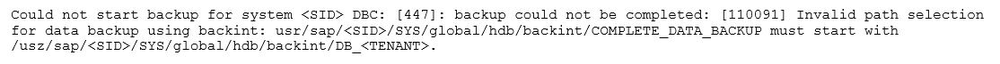

# AWS MLS 1-65

1. A company is migrating its SAP S/4HANA landscape from on premises to AWS. An SAP solutions architect is designing a backup solution for the SAP S/4HANA landscape on AWS. The backup solution will use AWS Backint Agent for SAP HANA (AWS Backint agent) to store backups in Amazon S3. The company's backup policy for source systems requires a retention period of 150 days for weekly full online backups. The backup policy requires a retention period of 30 days for daily transaction log backups. The company must keep the same backup policy on AWS while maximizing data resiliency. The company needs the ability to retrieve the backup data one or two times each year within 10 hours of the retrieval request. The SAP solutions architect must configure AWS Backint agent and S3 Lifecycle rules according to these parameters. Which solution will meet these requirements MOST cost-effectively?
   - [ ] A. Configure the target S3 bucket to use S3 Glacier Deep Archive for the backup files. Create S3 Lifecycle rules on the S3 bucket to delete full online backup files that are older than 150 days and to delete log backup files that are older than 30 days.
   - [ ] B. Configure the target S3 bucket to use S3 Standard storage for the backup files. Create an S3 Lifecycle rule on the S3 bucket to move all the backup files to S3 Glacier Instant Retrieval. Create additional S3 Lifecycle rules to delete full online backup files that are older than 150 days and to delete log backup files that are older than 30 days.
   - [ ] C. Configure the target S3 bucket to use S3 One Zone-Infrequent Access (S3 One Zone-IA) for the backup files. Create S3 Lifecycle rules on the S3 bucket to move full online backup files that are older than 30 days to S3 Glacier Flexible Retrieval and to delete log backup files that are older than 30 days. Create an additional S3 Lifecycle rule to delete full online backup files that are older than 150 days.
   - [ ] D. Configure the target S3 bucket to use S3 Standard-Infrequent Access (S3 Standard-IA) for the backup files. Create S3 Lifecycle rules on the S3 bucket to move full online backup files that are older than 30 days to S3 Glacier Flexible Retrieval and to delete log backup files that are older than 30 days. Create an additional S3 Lifecycle rule to delete full online backup files that are older than 150 days.

   <details>
      <summary>Answer</summary>

      D.
      - Data Retention: Full online backups should be retained for 150 days, and daily transaction log backups for 30 days.
      - Data Retrieval: The ability to retrieve backup data within 10 hours.
      - Here are the different S3 storage classes' considerations:
        - S3 Glacier Deep Archive: This is the lowest cost storage class and supports long-term retention and digital preservation. Retrieval times can be up to 12 hours.
        - S3 Glacier Instant Retrieval: As of my last update in September 2021, there's no "S3 Glacier Instant Retrieval" storage class in AWS. However, assuming that it provides quicker retrieval, we would need to consider the cost-effectiveness.
        - S3 One Zone-Infrequent Access (One Zone-IA): This storage class stores data in a single availability zone and is designed for data that can be recreated if lost. It is less expensive than S3 Standard-IA.
        - S3 Standard-Infrequent Access (Standard-IA): This is for data that is accessed less frequently, but requires rapid access when needed.
      - Considering the above:
        - A. Glacier Deep Archive is the most cost-effective storage, but the retrieval time can be up to 12 hours, which violates the 10-hour requirement.
        - B. This might be a feasible option if "S3 Glacier Instant Retrieval" offers quick retrievals, but we need to consider the cost.
        - C. One Zone-IA might be cost-effective, but it risks data durability as it stores data in a single AZ. If that AZ becomes unavailable, the data could be lost. The requirement is to maximize data resiliency, which One Zone-IA doesn't provide.
        - D. Standard-IA provides good durability by storing data across multiple AZs. Transitioning data to S3 Glacier Flexible Retrieval (if it provides retrieval within 10 hours) after 30 days can be cost-effective.
      - Based on the given information: The answer is D. Configure the target S3 bucket to use S3 Standard-Infrequent Access (S3 Standard-IA) for the backup files. Create S3 Lifecycle rules on the S3 bucket to move full online backup files that are older than 30 days to S3 Glacier Flexible Retrieval and to delete log backup files that are older than 30 days. Create an additional S3 Lifecycle rule to delete full online backup files that are older than 150 days.

   </details>

2. A global retail company is running its SAP S/4HANA workload on AWS. The company's business has grown in the past few years, and user activity has generated a significant amount or data in the SAP S/4HANA system.
The company wants to expand into new geographies. Before the company finalizes the expansion plan, the company wants to perform analytics on the historical data from the past few years. The company also wants to generate sales forecasts for potential expansion locations.
An SAP solutions architect must implement a solution to extract the data from SAP S/4HANA into Amazon S3. The solution also must perform the required analytics and forecasting tasks.
Which solution will meet these requirements with the LEAST custom development effort?
   - [ ] A. Use AWS AppSync to extract the data from SAP S/4HANA and to store the data in Amazon S3. Use AWS Glue to perform analytics. Use Amazon Forecast for sales forecasts.
   - [ ] B. Use the SAP Landscape Transformation (LT) Replication Server SDK to extract the data, to integrate the data with SAP Data Services, and to store the data in Amazon S3. Use Amazon Athena to perform analytics. Use Amazon Forecast for sales forecasts.
   - [ ] C. Use Amazon AppFlow to extract the data from SAP S/4HANA and to store the data in Amazon S3. Use Amazon QuickSight to perform analytics. Use Amazon Forecast for sales forecasts.
   - [ ] D. Integrate AWS Glue and AWS Lambda with the SAP Operational Data Provisioning (ODP) Framework to extract the data from SAP S/4HANA and to store the data in Amazon S3. Use Amazon QuickSight to perform analytics. Use Amazon Forecast for sales forecasts.

   <details>
      <summary>Answer</summary>

      C.
      - Option A is not suitable as AWS AppSync is not intended for this kind of workload.
      - Option B is a valid choice but might involve a significant setup for both SAP LT Replication and SAP Data Services.
      - Option C uses AWS-native services that are designed to integrate with each other and with SaaS applications, providing a streamlined solution.
      - Option D might require more custom development and integration effort.

   </details>

3. A company's SAP solutions architect needs to design an architecture to deploy a highly available SAP S/4HANA application on AWS. The company requires the SAP NetWeaver ASAP ASCS components and the SAP HANA database components or the application to be highly available. The company will operate the SAP NetWeaver ASCS, SAP NetWeaver PAS, and SAP HANA database components on separate Amazon EC2 instances. Each EC2 instance will run the Red Hat Enterprise Linux operating system. The company's AWS account has a VPC with a CIDR block that uses the 10.0.0.0/24 address block. The VPC contains two subnets. Each subnet is assigned to a different Availability Zone. The company has no other VPCs in this account, and the company has no other AWS accounts. Which set of overlay IP addresses can the SAP solutions architect use to provide the required highly available architecture?
   - [ ] A. Two overlay IP addresses: 10.0.0.50 for SAP ASCS and 10.0.0.54 for SAP HANA
   - [ ] B. Two overlay IP addresses: 192.168.0.50 for SAP ASCS and 192.168.0.54 for SAP HANA
   - [ ] C. Three overlay IP addresses: 10.0.0.50 for SAP ASCS, 10.0.0.52 for SAP ERS, and 10.0.0.54 for SAP HANA
   - [ ] D. Three overlay IP addresses: 192.168.0.50 for SAP ASCS, 192.168.0.52 for SAP ERS, and 192.168.0.54 for SAP HANA

   <details>
      <summary>Answer</summary>

      C.
      The key consideration here is to ensure high availability for the SAP NetWeaver ASCS (Application Server Central Services) and SAP HANA. For high availability setups in SAP, the usage of Enqueue Replication Servers (ERS) is common. ERS is used to replicate the lock table, which is managed by the ASCS instance.

      The SAP documentation typically references using three IP addresses in high-availability clusters:
      - For the ASCS instance.
      - For the ERS instance.
      - For the database (SAP HANA in this context).

      Given the above, we require three overlay IP addresses. Regarding the IP address ranges, the overlay IPs should fall within the VPC's CIDR range. The given VPC CIDR block is 10.0.0.0/24, which means any IP within the 10.0.0.1 to 10.0.0.254 range can be used (excluding the network and broadcast addresses). Thus, the correct choice is: C. Three overlay IP addresses: 10.0.0.50 for SAP ASCS, 10.0.0.52 for SAP ERS, and 10.0.0.54 for SAP HANA.

   </details>

4. A company has grown rapidly in a short period of time. This growth has led to an increase in the volume of data, the performance requirements for storage, and the memory and vCPU requirements for the company's SAP HANA database that runs on AWS. The SAP HANA database is a scale-up installation. Because of the increased requirements, the company plans to change the Amazon EC2 instance type to a virtual EC2 High Memory instance and plans to change the Amazon Elastic Block Store (Amazon EBS) volume type to a higher performance volume type for the SAP HANA database. The EC2 instance is a current-generation instance, both before and after the change. Additionally, the EC2 instance and the EBS volume meet all the prerequisites for instance type change and EBS volume type change. An SAP basis administrator must advise the company about whether these changes will require downtime for the SAP system. Which guidance should the SAP basis administrator provide to the company?
   - [ ] A. The change in EC2 instance type does not require SAP system downtime, but the change in EBS volume type requires SAP system downtime.
   - [ ] B. The change in EC2 instance type requires SAP system downtime, but the change in EBS volume type does not require SAP system downtime.
   - [ ] C. Neither the change in EC2 instance type nor the change in EBS volume type requires SAP system downtime.
   - [ ] D. Both the change in EC2 instance type and the change in EBS volume type require SAP system downtime.

   <details>
      <summary>Answer</summary>

      B.
      - Changing an Amazon EC2 instance type: When you change the EC2 instance type (especially for a memory-intensive application like SAP HANA), you need to stop the instance, change the instance type, and then start the instance. The process of stopping and starting the instance will interrupt the availability of SAP HANA, which means there will be downtime for the SAP system.
      - Changing the Amazon EBS volume type: Changing the type of an EBS volume typically involves modifying the volume type, which can often be done without detaching the volume or restarting the instance that it's attached to. Therefore, many EBS volume modifications do not require downtime.

   </details>

5. A company is running its on-premises SAP ERP Central Component (SAP ECC) system on an Oracle database on Oracle Enterprise Linux. The database is 1 TB in size and uses 27,000 IOPS for its peak performance Multiple SSD volumes are striped to store Oracle data files in separate sapdata directories to gain the required IOPS. The company is planning to move this workload to AWS. The company chooses high I/O bandwidth instances with a Nitro hypervisor to host the target database instance. Downtime is not a constraint for the migration. The company needs an Amazon Elastic Block Store (Amazon EBS) storage layout that optimizes cost for the migration. How should the company reorganize the Oracle data files to meet these requirements?
   - [ ] A. Reorganize the Oracle data files into one 9 TB General Purpose SSD (gp2) EBS volume.
   - [ ] B. Reorganize the Oracle data files into a striped volume of three 3 TB General Purpose SSD (gp2) EBS volumes.
   - [ ] C. Reorganize the Oracle data files into one 1 TB General Purpose SSD (gp3) EBS volume with 27,000 provisioned IOPS.
   - [ ] D. Reorganize the Oracle data files into ten 100 GB General Purpose SSD (gp3) EBS volumes.

   <details>
      <summary>Answer</summary>

      D.
      Ten 100 GB gp3 EBS volumes: Each volume would provide a baseline performance of 3,000 IOPS and cost optimized.

   </details>

6. An SAP engineer is designing an SAP S/4HANA high availability architecture on Linux Amazon EC2 instances in two Availability Zones. The SAP engineer needs to create a solution to achieve high availability and consistency for /usr/sap/trans end /usr/sap/ file systems. Which solution will meet these requirements with the MOST reliability?
   - [ ] A. Set up an NFS server on one of the EC2 instances.
   - [ ] B. Use Amazon Elastic File System (Amazon EFS).
   - [ ] C. Use the EC2 local instance store.
   - [ ] D. Use Amazon Elastic Block Store (Amazon EBS) Multi-Attach.

    <details>
      <summary>Answer</summary>

      B.

   </details>

7. A company migrated its SAP environment to AWS 6 months ago. The landscape consists of a few thousand Amazon EC2 instances for production, development, quality, and sandbox environments. The company wants to minimize the operational cost of the landscape without affecting system performance and availability. Which solutions will meet these requirements? (Choose two.)
   - [ ] A. Scale down the EC2 instance size for non-production environments.
   - [ ] B. Create an AWS Systems Manager document to automatically stop and start the SAP systems. Use Amazon CloudWatch to automate the scheduling of this task.
   - [ ] C. Review the billing data for the EC2 instances. Analyze the workload, and choose an EC2 Instance Savings Plan.
   - [ ] D. Create an AWS Systems Manager document to automatically stop and start the SAP systems and EC2 instances for non-production environments outside business hours. Use Amazon EventBridge to automate the scheduling of this task.
   - [ ] E. Create an AWS Systems Manager document to automatically stop and start the SAP systems and EC2 instances. Maintain the schedule in the Systems Manager document to automate this task.

    <details>
      <summary>Answer</summary>

      AD.
      - Scaling down is one of the most direct ways to save costs.
      - Stopping instances outside of business hours can also lead to significant savings, especially for non-production environments.

   </details>

8. An SAP solutions architect needs to design a highly available solution to support a 12 TB SAP HANA system on AWS. The solution will be deployed in a single AWS Region. Which solution will meet these requirements MOST cost-effectively?
   - [ ] A. Use an SAP certified high availability cluster solution and SAP HANA backup and restore.
   - [ ] B. Use an SAP certified high availability cluster solution and SAP HANA system replication with data preload.
   - [ ] C. Use an SAP certified high availability cluster solution and multi-tiered SAP HANA system replication.
   - [ ] D. Use an SAP certified high availability cluster solution and storage replication with AWS Elastic Disaster Recovery.

   <details>
      <summary>Answer</summary>

      D.
      <https://docs.aws.amazon.com/wellarchitected/latest/sap-lens/best-practice-17-2.html>

   </details>

9. A company's SAP solutions architect is configuring a network architecture for an SAP HANA multi-node environment. The company requires isolation of the logical network zones: client, internal, and storage. The database runs on X1 (memory optimized) Amazon EC2 instances and uses Amazon Elastic Block Store (Amazon EBS) volumes for persistent storage. Which combination of actions will provide the required isolation? (Choose three.)
   - [ ] A. Attach an AWS Network Firewall policy for each zone to the subnet for the node cluster.
   - [ ] B. Attach a secondary elastic network interface to each instance for the internal communications between nodes.
   - [ ] C. Attach a secondary elastic network interface to each instance for the storage communications.
   - [ ] D. Configure a security group with rules that allow only TCP connections within the security group on the ports that are assigned for the internal network connections. Associate the security group with the appropriate elastic network interface on each instance.
   - [ ] E. Configure a security group with rules that allow only TCP connections with the external customer network on the ports that are assigned for the client connections. Associate the security group with the appropriate elastic network interface.
   - [ ] F. Configure a security group with rules that allow Non-Volatile Memory Express (NVMe) connections within the subnet range. Associate the security group with the appropriate elastic network interface on each instance.

   <details>
      <summary>Answer</summary>

      BCD.

   </details>

10. An SAP database analyst installs AWS Backint Agent for SAP HANA (AWS Backint agent) by using AWS Systems Manager. The SAP database analyst runs an initial test to perform a database backup for a 512 GB SAP HANA database. The database runs on an SAP certified Amazon EC2 instance type with General Purpose SSD (gp2) Amazon Elastic Block Store (Amazon EBS) volumes for all disk storage. The backup is running too slowly. Which actions should the SAP database analyst take to improve the performance of AWS Backint agent? (Choose two.)

    - [ ] A. Set the parallel_data_backup_backint_channels parameter to a number greater than 1.
    - [ ] B. Select a Provisioned IOPS SSD (io2) volume as the backup target for AWS Backint agent.
    - [ ] C. Delete unnecessary older backup files from backups that SAP Backint agent performed.
    - [ ] D. Change the existing gp2-based SAP HANA data volumes to the Provisioned IOPS SSD (io2) EBS volume type.
    - [ ] E. Reinstall AWS Backint agent by using the AWS Backint installer rather than the Systems Manager document.

    <details>
      <summary>Answer</summary>

      AD.
      Increasing the value of the parallel_data_backup_backint_channels parameter allows the Backint agent to execute more than one backup process in parallel, improving the overall backup speed. Switching the EBS volume type from gp2 to io2 provides more consistent and faster I/O performance, which can also speed up backup processes.

     </details>

11. A company is planning to retire a data center where a few legacy SAP applications run. The applications are SAP R/3 4.6C with a Microsoft SQL Server 2005 database end are running on Windows Server 2008. The applications are outside the extended maintenance period. There is no SAP support for the applications. The company has no plans to upgrade the applications or move the applications to a different platform. The company does not have a policy to maintain installation media for any of the applications. The company wants to migrate the applications to AWS. How can the company migrate the applications to AWS?
    - [ ] A. Use AWS Launch Wizard for SAP to launch the applications on AWS. Migrate the applications by using backup and restore.
    - [ ] B. Perform an SAP system copy from the source to the target by using SAP Software Provisioning Manager.
    - [ ] C. Use AWS Application Migration Service to migrate the applications.
    - [ ] D. Manually install the applications on AWS. Perform a database synchronization from the source to the target.

    <details>
       <summary>Answer</summary>

       C.

    </details>

12. A company is running its SAP S/4HANA production system on AWS. The system is 5 TB in size and has a high performance and IOPS demand for the SAP HANA data storage. The company is using Amazon Elastic Block Store (Amazon EBS) General Purpose SSD (gp2) storage with burstable IOPS to meet this demand. An SAP solutions architect needs to review the current storage layout and recommend a more cost-effective solution without compromising storage performance. What should the SAP solutions architect recommend to meet these requirements?
    - [ ] A. Switch from burstable IOPS to allocated IOPS for the gp2 storage.
    - [ ] B. Replace all the gp2 storage with Provisioned IOPS SSD (io2) storage.
    - [ ] C. Replace all the gp2 storage with gp3 storage. Configure the required IOPS.
    - [ ] D. Replace all the gp2 storage with gp3 storage at baseline IOPS.

    <details>
       <summary>Answer</summary>

       C.

    </details>

13. A company uses SAP S/4HANA as its ERP solution. The company is using AWS Backint Agent for SAP HANA (AWS Backint agent) for backups. Although the configuration is correct for AWS Backint agent, the backups are falling with the following error.`NoCredentialProviders: no valid providers in chain.` What could be the reason for this error?
    - [ ] A. AWS Systems Manager Agent is not installed on the Amazon EC2 instance.
    - [ ] B. No IAM role is attached to the Amazon EC2 instance.
    - [ ] C. AWS Backint agent binaries are owned by a non-root user.
    - [ ] D. AWS Backint agent is connecting to Amazon S3 with VPC endpoints.

    <details>
       <summary>Answer</summary>

       B.

    </details>

14. A company needs to migrate its SAP HANA landscape from an on-premises data center to AWS. The company's existing SAP HANA database instance is oversized. The company must resize the database instance as part of the migration. Which combination of steps should the company take to ensure that the target Amazon EC2 instance is sized optimally for the SAP HANA database instance? (Choose two.)
    - [ ] A. Determine the peak memory utilization of the existing on-premises SAP HANA system.
    - [ ] B. Determine the average memory utilization of the existing on-premises SAP HANA system.
    - [ ] C. For the target system, select any SAP certified EC2 instance that provides more memory than the current average memory utilization.
    - [ ] D. For the target system, select the smallest SAP certified EC2 instance that provides more memory than the current peak memory utilization.
    - [ ] E. For the target system, select any current-generation EC2 memory optimized instance.

    <details>
       <summary>Answer</summary>

       AD.
       When sizing an SAP HANA instance, it's crucial to take into account the peak memory utilization. Choosing an instance size that is based on the average memory utilization may result in performance issues during periods of peak demand. Therefore, it's important to choose an instance that can handle the highest memory demand anticipated. It's also more cost-effective to choose the smallest instance that meets these requirements.

    </details>

15. A company plans to migrate a critical SAP S/4HANA workload from on-premises hardware to AWS. An SAP solutions architect needs to develop a solution to effectively monitor the SAP landscape on AWS for this workload. The solution must capture resource utilization and must follow a serverless approach to monitor the SAP environment. The solution also must track all the API calls that are made within the company's AWS account. Which combination of steps should the SAP solutions architect take to meet these requirements? (Choose two.)
    - [ ] A. Configure Amazon CloudWatch detailed monitoring for the AWS resources in the SAP landscape. Use AWS Lambda, and create the Lambda layer "sapjco" for the SAP Java Connector. Deploy the solution with AWS Serverless Application Repository for sap-monitor.
    - [ ] B. Set up a Multi-AZ deployment of SAP on AWS. Use Amazon EC2 Auto Scaling to add or remove EC2 instances automatically based on the CPU utilization of the SAP instance.
    - [ ] C. Use AWS CloudTrail to log and retain account activity related to actions across the SAP on AWS infrastructure.
    - [ ] D. Use the AWS Personal Health Dashboard to get a personalized view of performance and availability of the underlying AWS resources.
    - [ ] E. Use AWS Trusted Advisor to optimize the AWS infrastructure and to improve security and performance.
    <details>
       <summary>Answer</summary>

       AC.
       - For monitoring the SAP landscape using a serverless approach: Option A is appropriate.
       - For tracking all the API calls that are made within the company's AWS account: Option C is the best choice.

    </details>

16. A company is planning to deploy SAP HANA on AWS. The block storage that hosts the SAP HANA data volume must have at least 64,000 IOPS per volume and must have a maximum throughput of at least 500 MiB/s per volume. Which Amazon Elastic Block Store (Amazon EBS) volume meets these requirements?
    - [ ] A. General Purpose SSD (gp2) EBS volume
    - [ ] B. General Purpose SSD (gp3) EBS volume
    - [ ] C. Provisioned IOPS SSD (io2) EBS volume
    - [ ] D. Throughput Optimized HDD (st1) EBS volume

    <details>
       <summary>Answer</summary>

       C.
       The Provisioned IOPS SSD (io2) EBS volume allows you to provision up to 64,000 IOPS per volume, which is suitable for the IOPS requirement mentioned in the question. Furthermore, io2 volumes offer a maximum throughput of 1,000 MiB/s per volume, which also meets the requirement for a maximum throughput of at least 500 MiB/s per volume.

    </details>

17. A company is designing a disaster recovery (DR) strategy for an SAP HANA database that runs on an Amazon EC2 instance in a single Availability Zone. The company can tolerate a long RTO and an RPO greater than zero if it means that the company can save money on its DR process The company has configured an Amazon CloudWatch alarm to automatically recover the EC2 instance if the instance experiences an unexpected issue. The company has set up AWS Backint Agent for SAP HANA to save the backups into Amazon S3. What is the MOST cost-effective DR option for the company's SAP HANA database?
    - [ ] A. Set up AWS CloudFormation to automatically launch a new EC2 instance for the SAP HANA database in a second Availability Zone from backups that are stored in Amazon S3. When the SAP HANA database is operational, perform a database restore by using the standard SAP HANA restore process.
    - [ ] B. Launch a secondary EC2 instance for the SAP HANA database on a less powerful EC2 instance type in a second Availability Zone. Configure SAP HANA system replication with the preload option turned off.
    - [ ] C. Launch a secondary EC2 instance for the SAP HANA database on an equivalent EC2 instance type in a second Availability Zone. Configure SAP HANA system replication with the preload option turned on.
    - [ ] D. Set up AWS CloudFormation to automatically launch a new EC2 instance for the SAP HANA database in a second Availability Zone from backups that are stored in Amazon Elastic Block Store (Amazon EBS). When the SAP HANA database is operational, perform a database restore by using the standard SAP HANA restore process.

    <details>
       <summary>Answer</summary>

       A.

    </details>

18. A company is using a multi-account strategy for SAP HANA and SAP BW/4HANA instances across development, QA, and production systems in the same AWS Region. Each system is hosted in its own VPC. The company needs to establish cross-VPC communication between the SAP systems. The company might add more SAP systems in the future. The company must create connectivity across the SAP systems and hundreds of AWS accounts. The solution must maximize scalability and reliability. Which solution will meet these requirements?
    - [ ] A. Create an AWS Transit Gateway in a central networking account. Attach the transit gateway to the AWS accounts. Set up routing and a network ACL to establish communication.
    - [ ] B. Set up VPC peering between the accounts. Configure routing in each VPC to use the VPC peering links.
    - [ ] C. Create a transit VPC that uses the hub-and-spoke model. Set up routing to use the transit VPC for communication between the SAP systems.
    - [ ] D. Create a VPC link for each SAP system. Use the VPC links to connect the SAP systems.

    <details>
       <summary>Answer</summary>

       A.

    </details>

19. A company is planning to deploy a new SAP NetWeaver ABAP system on AWS with an Oracle database that runs on an Amazon EC2 instance. The EC2 instance uses a Linux-based operating system. The company needs a database storage solution that provides flexibility to adjust the IOPS regardless of the allocated storage size. Which solution will meet these requirements MOST cost-effectively?
    - [ ] A. General Purpose SSD (gp3) Amazon Elastic Block Store (Amazon EBS) volumes
    - [ ] B. Amazon Elastic File System (Amazon EFS) Standard-Iinfrequent Access (Standard-IA) storage class
    - [ ] C. Amazon FSx for Windows File Server
    - [ ] D. Provisioned IOPS SSD (io2) Amazon Elastic Block Store (Amazon EBS) volumes

    <details>
       <summary>Answer</summary>

       A.

    </details>

20. A company is using SAP NetWeaver with Java on AWS. The company has updated its generation of Amazon EC2 instances to the most recent generation of EC2 instances. When the company tries to start SAP, the startup fails. The log indicates that the SAP license expired or is not valid. What is the reason for this issue?
    - [ ] A. The instance ID changed as part of the EC2 generation change.
    - [ ] B. The instance’s hypervisor changed from Xen to Nitro.
    - [ ] C. The SAP Java Virtual Machine (SAP JVM) is not compatible with the new instance type.
    - [ ] D. An EC2 generation change is not supported for SAP Java-based systems.

    <details>
       <summary>Answer</summary>

       B.

    </details>

21. A company’s basis administrator is planning to deploy SAP on AWS in Linux. The basis administrator must set up the proper storage to store SAP HANA data and log volumes. Which storage options should the basis administrator choose to meet these requirements? (Choose two.)
    - [ ] A. Amazon Elastic Block Store (Amazon EBS) Throughput Optimized HDD (st1)
    - [ ] B. Amazon Elastic Block Store (Amazon EBS) Provisioned OPS SSD (io1, io2)
    - [ ] C. Amazon S3
    - [ ] D. Amazon Elastic File System (Amazon EFS)
    - [ ] E. Amazon Elastic Block Store (Amazon EBS) General Purpose SSD (gp2, gp3)

    <details>
       <summary>Answer</summary>

       BE. <https://docs.aws.amazon.com/sap/latest/sap-hana/hana-ops-storage-config.html>

    </details>

22. A company has deployed a highly available SAP NetWeaver system on SAP HANA into a VPC. The system is distributed across multiple Availability Zones within a single AWS Region. SAP NetWeaver is running on SUSE Linux Enterprise Server for SAP. SUSE Linux Enterprise High Availability Extension is configured to protect SAP ASCS and ERS instances and uses the overlay IP address concept. The SAP shared files /sapmnt and /usr/sap/trans are hosted on an Amazon Elastic File System (Amazon EFS) file system. The company needs a solution that uses already-existing private connectivity to the VPC. The SAP NetWeaver system must be accessible through the SAP GUI client tool. Which solutions will meet these requirements? (Choose two.)
    - [ ] A. Deploy an Application Load Balancer. Configure the overlay IP address as a target.
    - [ ] B. Deploy a Network Load Balancer. Configure the overlay IP address as a target.
    - [ ] C. Use an Amazon Route 53 private zone. Create an A record that has the overlay IP address as a target.
    - [ ] D. Use AWS Transit Gateway. Configure the overlay IP address as a static route in the transit gateway route table. Specify the VPC as a target. Most Voted
    - [ ] E. Use a NAT gateway. Configure the overlay IP address as a target.
  
    <details>
       <summary>Answer</summary>

       BD.

    </details>

23. A company is planning to move all its SAP applications to Amazon EC2 instances in a VPC. Recently, the company signed a multiyear contract with a payroll software-as-a-service (SaaS) provider. Integration with the payroll SaaS solution is available only through public web APIs. Corporate security guidelines state that all outbound traffic must be validated against an allow list. The payroll SaaS provider provides only fully qualified domain name (FQDN) addresses and no IP addresses or IP address ranges. Currently, an on-premises firewall appliance filters FQDNs. The company needs to connect an SAP Process Orchestration (SAP PO) system to the payroll SaaS provider. What must the company do on AWS to meet these requirements?
    - [ ] A. Add an outbound rule to the security group of the SAP PO system to allow the FQDN of the payroll SaaS provider and deny all other outbound traffic.
    - [ ] B. Add an outbound rule to the network ACL of the subnet that contains the SAP PO system to allow the FQDN of the payroll SaaS provider and deny all other outbound traffic.
    - [ ] C. Add an AWS WAF web ACL to the VPAdd an outbound rule to allow the SAP PO system to connect to the FQDN of the payroll SaaS provider.
    - [ ] D. Add an AWS Network Firewall firewall to the VPC. Add an outbound rule to allow the SAP PO system to connect to the FQDN of the payroll SaaS provider.

    <details>
       <summary>Answer</summary>

       D: FQDN filtering can be achieved only through Firewall

    </details>

24. A company is planning to migrate its on-premises SAP application to AWS. The application runs on VMware vSphere. The SAP ERP Central Component (SAP ECC) server runs on an IBM Db2 database that is 2 TB in size. The company wants to migrate the database to SAP HANA. Which migration strategy will meet these requirements?
    - [ ] A. Use AWS Application Migration Service (CloudEndure Migration).
    - [ ] B. Use SAP Software Update Manager (SUM) Database Migration Option (DMO) with System Move.
    - [ ] C. Use AWS Server Migration Service (AWS SMS).
    - [ ] D. Use AWS Database Migration Service (AWS DMS).

    <details>
       <summary>Answer</summary>

       B.

    </details>

25. A company hosts multiple SAP applications on Amazon EC2 instances in a VPC. While monitoring the environment, the company notices that multiple port scans are attempting to connect to SAP portals inside the VPC. These port scans are originating from the same IP address block. The company must deny access to the VPC from all the offending IP addresses for the next 24 hours. Which solution will meet this requirement?
    - [ ] A. Modify network ACLs that are associated with all public subnets in the VPC to deny access from the IP address block.
    - [ ] B. Add a rule in the security group of the EC2 instances to deny access from the IP address block.
    - [ ] C. Create a policy in AWS Identity and Access Management (IAM) to deny access from the IP address block.
    - [ ] D. Configure the firewall in the operating system of the EC2 instances to deny access from the IP address block.
    <details>
       <summary>Answer</summary>

       A.

    </details>

26. A company has deployed SAP workloads on AWS. The AWS Data Provider for SAP is installed on the Amazon EC2 instance where the SAP application is running. An SAP solutions architect has attached an IAM role to the EC2 instance with the following policy. The AWS Data Provider for SAP is not returning any metrics to the SAP application. Which change should the SAP solutions architect make to the IAM permissions to resolve this issue?

    ```json
    {
       "Version": "2012-10-17",
       "Statement": [
          {
             "Sid": "AWSDataProvider1",
             "Effect": "Allow",
             "Action": [
                "EC2:DescribeInstance",
                "EC2:DescrineVolumes"
             ],
             "Resource": "*"
          },
          {
             "Sid": "AWSDataProvider2",
             "Effect": "Allow",
             "Action": "S3:GetObject",
             "Resource": [
                "arn:aws:s3::aws-sap-data-provider/config.properties"
             ]
          }
       ]
    }
    ```

    - [ ] A. Add the cloudwatch:ListMetrics action to the policy statement with Sid AWSDataProvider1.
    - [ ] B. Add the cloudwatch:GetMetricStatistics action to the policy statement with Sid AWSDataProvider1.
    - [ ] C. Add the cloudwatch:GetMetricStream action to the policy statement with Sid AWSDataProvider1.
    - [ ] D. Add the cloudwatch:DescribeAlarmsForMetric action to the policy statement with Sid AWSDataProvider1.search and discover metadata.

    <details>
       <summary>Answer</summary>

       B. cloudwatch:GetMetricStatistics action is necessary to get metric data from CloudWatch, which will allow the data provider to collect and present the metrics to the SAP application

    </details>

27. A company wants to deploy an SAP HANA database on AWS by using AWS Launch Wizard for SAP. An SAP solutions architect needs to run a custom post-deployment script on the Amazon EC2 instance that Launch Wizard provisions. Which actions can the SAP solutions architect take to provide the post-deployment script in the Launch Wizard console? (Choose two.)
    - [ ] A. Provide the FTP URL of the script.
    - [ ] B. Provide the HTTPS URL of the script on a web server.
    - [ ] C. Provide the Amazon S3 URL of the script.
    - [ ] D. Write the script inline.
    - [ ] E. Upload the script.
    <details>
       <summary>Answer</summary>

       CE.

    </details>

28. A company is planning to move its on-premises SAP HANA database to AWS. The company needs to migrate this environment to AWS as quickly as possible. An SAP solutions architect will use AWS Launch Wizard for SAP to deploy this SAP HANA workload. Which combination of steps should the SAP solutions architect follow to start the deployment of this workload on AWS? (Choose three.)
    - [ ] A. Download the SAP HANA software.
    - [ ] B. Download the AWS CloudFormation template for the SAP HANA deployment.
    - [ ] C. Download and extract the SAP HANA software. Upload the SAP HANA software to an FTP server that Launch Wizard can access.
    - [ ] D. Upload the unextracted SAP HANA software to an Amazon S3 destination bucket. Follow the S3 file path syntax for the software in accordance with Launch Wizard recommendations.
    - [ ] E. Bring the operating system AMI by using the Bring Your Own Image (BYOI) model, or purchase the subscription for the operating system AMI from AWS Marketplace.
    - [ ] F. Create the SAP file system by using Amazon Elastic Block Store (Amazon EBS) before the deployment.

    <details>
       <summary>Answer</summary>

       ADE.

    </details>

29. A company wants to implement SAP HANA on AWS with the Multi-AZ deployment option by using AWS Launch Wizard for SAP. The solution will use SUSE Linux Enterprise High Availability Extension for the high availability deployment. An SAP solutions architect must ensure that all the prerequisites are met. The SAP solutions architect also must ensure that the user inputs to start the guided deployment of Launch Wizard are valid. Which combination of steps should the SAP solutions architect take to meet these requirements? (Choose two.)
    - [ ] A. Before starting the Launch Wizard deployment, create the underlying Amazon Elastic Block Store (Amazon EBS) volume types to use for SAP HANA data and log volumes based on the performance requirements.
    - [ ] B. Use a value for the PaceMakerTag parameter that is not used by any other Amazon EC2 instances in the AWS Region where the system is being deployed.
    - [ ] C. Ensure that the virtual hostname for the SAP HANA database that is used for the SUSE Linux Enterprise High Availability Extension configuration is not used in any other deployed accounts.
    - [ ] D. Ensure that the VirtuallPAddress parameter is outside the VPC CIDR and is not being used in the route table that is associated with the subnets where primary and secondary SAP HANA instances will be deployed.
    - [ ] E. Before starting the Launch Wizard deployment, set up the SUSE Linux Enterprise High Availability Extension network configuration and security group.

    <details>
       <summary>Answer</summary>

       BD. SLES HAE and RHEL High Availability agents require that the Pacemaker tag and the overlay IP address you provide by setting deployment parameters can be uniquely identified.
    </details>

30. A company that has SAP workloads on premises plans to migrate an SAP environment to AWS. The company is new to AWS and has no prior setup. The company has the following requirements: The application server and database server must be placed in isolated network configurations. (1) SAP systems must be accessible to the on-premises end users over the internet. (2) The cost of communications between the application server and the database server must be minimized. (3) Which combination of steps should an SAP solutions architect take to meet these requirements? (Choose two.)
    - [ ] A. Configure a Network Load Balancer for incoming connections from end users.
    - [ ] B. Set up an AWS Site-to-Site VPN connection between the company’s on-premises network and AWS.
    - [ ] C. Separate the application server and the database server by using different VPCs.
    - [ ] D. Separate the application server and the database server by using different subnets and network security groups within the same VPC.
    - [ ] E. Set up an AWS Direct Connect connection with a private VIF between the company’s on-premises network and AWS.

    <details>
       <summary>Answer</summary>

       BD.

    </details>

31. A company is running its SAP workload on AWS. The company’s security team has implemented the following requirements: (1) All Amazon EC2 instances for SAP must be SAP certified instance types. (2) Encryption must be enabled for all Amazon S3 buckets and Amazon Elastic Block Store (Amazon EBS) volumes. (3) AWS CloudTrail must be activated. (4) SAP system parameters must be compliant with business rules. (5) Detailed monitoring must be enabled for all instances. The company wants to develop an automated process to review the systems for compliance with the security team’s requirements. The process also must provide notification about any deviation from these standards. Which solution will meet these requirements?
    - [ ] A. Use AWS AppConfig to model configuration data in an AWS Systems Manager Automation runbook. Schedule this Systems Manager Automation runbook to monitor for compliance with all the requirements. Integrate AWS AppConfig with Amazon CloudWatch for notification purposes.
    - [ ] B. Use AWS Config managed rules to monitor for compliance with all the requirements. Use Amazon EventBridge (Amazon CloudWatch Events) and Amazon Simple Notification Service (Amazon SNS) for email notification when a resource is flagged as noncompliant.
    - [ ] C. Use AWS Trusted Advisor to monitor for compliance with all the requirements. Use Trusted Advisor preferences for email notification when a resource is flagged as noncompliant.
    - [ ] D. Use AWS Config managed rules to monitor for compliance with the requirements, except for the SAP system parameters. Create AWS Config custom rules to validate the SAP system parameters. Use Amazon EventBridge (Amazon CloudWatch Events) and Amazon Simple Notification Service (Amazon SNS) for email notification when a resource is flagged as noncompliant.
  
    <details>
       <summary>Answer</summary>

       D.

    </details>

32. A company is hosting its SAP workloads on AWS. An SAP solutions architect is designing high availability architecture for the company’s production SAP S/4HANA and SAP BW/4HANA workloads. These workloads have the following requirements: (1) Redundant SAP application servers that consist of a primary application server (PAS) and an additional application server (AAS) (2) ASCS and ERS instances that use a failover cluster (3) Database high availability with a primary DB instance and a secondary DB instance. How should the SAP solutions architect design the architecture to meet these requirements?
    - [ ] A. Deploy ASCS and ERS cluster nodes in different subnets within the same Availability Zone. Deploy the PAS instance and AAS instance in different subnets within the same Availability Zone. Deploy the primary DB instance and secondary DB instance in different subnets within the same Availability Zone. Deploy all the components in the same VPC.
    - [ ] B. Deploy ASCS and ERS cluster nodes in different subnets within the same Availability Zone. Deploy the PAS instance and AAS instance in different subnets within the same Availability Zone. Deploy the primary DB instance and secondary DB instance in different subnets within the same Availability Zone. Deploy the ASCS instance, PAS instance, and primary DB instance in one VPC. Deploy the ERS instance, AAS instance, and secondary DB instance in a different VPC.
    - [ ] C. Deploy ASCS and ERS cluster nodes in different subnets across two Availability Zones. Deploy the PAS instance and AAS instance in different subnets across two Availability Zones. Deploy the primary DB instance and secondary DB instance in different subnets across two Availability Zones. Deploy all the components in the same VPC.
    - [ ] D. Deploy ASCS and ERS cluster nodes in different subnets across two Availability Zones. Deploy the PAS instance and AAS instance in different subnets across two Availability Zones. Deploy the primary DB instance and secondary DB instance in different subnets across two Availability Zones. Deploy the ASCS instance, PAS instance, and primary DB instance in one VPC. Deploy the ERS instance, AAS instance, and secondary DB instance in a different VPC.
    <details>
       <summary>Answer</summary>

       C.

    </details>

33. A company has deployed SAP HANA in the AWS Cloud. The company needs its SAP HANA database to be highly available. An SAP solutions architect has deployed the SAP HANA database in separate Availability Zones in a single AWS Region. SUSE Linux Enterprise High Availability Extension is configured with an overlay IP address. The overlay IP resource agent has the following IAM policy, During a test of failover, the SAP solutions architect finds that the overlay IP address does not change to the secondary Availability Zone. Which change should the SAP solutions architect make in the policy statement for Sid oip1 to fix this error?

    ```json
    {
       "Version": "2012-10-17",
       "Statement": [
          {
             "Sid": "oip1",
             "Effect": "Allow",
             "Action": "EC2:AssociateRouteTable",
             "Resource": "arn:aws:ec2:us-east-1:111111111111:route-table/rtb-XYZ"
          },
          {
             "Sid": "oip2",
             "Effect": "Allow",
             "Action": "EC2:DescribeRouteTable",
             "Resource": "*"
          }
       ]
    }
    ```

    - [ ] A. Change the Action element to ec2:CreateRoute.
    - [ ] B. Change the Action element to ec2:ReplaceRoute.
    - [ ] C. Change the Action element to ec2:ReplaceRouteTableAssociation.
    - [ ] D. Change the Action element to ec2:ReplaceTransitGatewayRoute.
  
    <details>
       <summary>Answer</summary>

       B.

    </details>

34. A company wants to improve the RPO and RTO for its SAP disaster recovery (DR) solution by running the DR solution on AWS. The company is running SAP ERP Central Component (SAP ECC) on SAP HANA. The company has set an RPO of 15 minutes and an RTO of 4 hours. The production SAP HANA database is running on a physical appliance that has x86 architecture. The appliance has 1 TB of memory, and the SAP HANA global allocation limit is set to 768 GB. The SAP application servers are running as VMs on VMware, and they store data on an NFS file system. The company does not want to change any existing SAP HANA parameters that are related to data and log backup for its on-premises systems. What should an SAP solutions architect do to meet the DR objectives MOST cost-effectively?
    - [ ] A. For the SAP HANA database, change the log backup frequency to 5 minutes. Move the data and log backups to Amazon S3 by using the AWS CLI or AWS DataSync. Launch the SAP HANA database. For the SAP application servers, export the VMs as AMIs by using the VM Import/Export feature from AWS. For NFS file shares /sapmnt and /usr/sap/trans, establish real-time synchronization from DataSync to Amazon Elastic File System (Amazon EFS).
    - [ ] B. For the SAP HANA database, change the log backup frequency to 5 minutes. Move the data and log backups to Amazon S3 by using AWS Storage Gateway File Gateway. For the SAP application servers, export the VMs as AMIs by using the VM Import/Export feature from AWS. For NFS file shares /sapmnt and /usr/sap/trans, establish real-time synchronization from AWS DataSync to Amazon Elastic File System (Amazon EFS).
    - [ ] C. For the SAP HANA database, SAP application servers, and NFS file shares, use CloudEndure Disaster Recovery to replicate the data continuously from on premises to AWS. Use CloudEndure Disaster Recovery to launch target instances in the event of a disaster.
    - [ ] D. For the SAP HANA database, use a smaller SAP certified Amazon EC2 instance. Use SAP HANA system replication with ASYNC replication mode to replicate the data continuously from on premises to AWS. For the SAP application servers, use CloudEndure Disaster Recovery for continuous data replication. For NFS file shares /sapmnt and /usr/sap/trans, establish real-time synchronization from AWS DataSync to Amazon Elastic File System (Amazon EFS).

    <details>
       <summary>Answer</summary>

       D.

    </details>

35. A company is planning to migrate its on-premises SAP applications to AWS. The applications are based on Windows operating systems. A file share stores the transport directories and third-party application data on the network-attached storage of the company’s on-premises data center. The company’s plan is to lift and shift the SAP applications and the file share to AWS. The company must follow AWS best practices for the migration. Which AWS service should the company use to host the transport directories and third-party application data on AWS?
    - [ ] A. Amazon Elastic Block Store (Amazon EBS)
    - [ ] B. AWS Storage Gateway
    - [ ] C. Amazon Elastic File System (Amazon EFS)
    - [ ] D. Amazon FSx for Windows File Server

    <details>
       <summary>Answer</summary>

       D.

    </details>

36. A company hosts an SAP HANA database on an Amazon EC2 instance in the us-east-1 Region. The company needs to implement a disaster recovery (DR) site in the us-west-1 Region. The company needs a cost-optimized solution that offers a guaranteed capacity reservation, an RPO of less than 30 minutes, and an RTO of less than 30 minutes. Which solution will meet these requirements?
    - [ ] A. Deploy a single EC2 instance to support the secondary database in us-west-1 with additional storage. Use this secondary database instance to support QA and production. Configure the primary SAP HANA database in us-east-1 to constantly replicate the data to the secondary SAP HANA database in us-west-1 by using SAP HANA system replication with preload off. During DR, shut down the QA SAP HANA instance and restart the production services at the secondary site.
    - [ ] B. Deploy a secondary staging server on an EC2 instance in us-west-1. Use CloudEndure Disaster Recovery to replicate changes at the database level from us-east-1 to the secondary staging server on an ongoing basis. During DR, initiate cutover, increase the size of the secondary EC2 instance to match the primary EC2 instance, and start the secondary EC2 instance.
    - [ ] C. Set up the primary SAP HANA database in us-east-1 to constantly replicate the data to a secondary SAP HANA database in us-west-1 by using SAP HANA system replication with preload on. Keep the secondary SAP HANA instance as a hot standby that is ready to take over in case of failure.
    - [ ] D. Create an SAP HANA database AMI by using Amazon Elastic Block Store (Amazon EBS) snapshots. Replicate the database and log backup files from a primary Amazon S3 bucket in us-east-1 to a secondary S3 bucket in us-west-1. During DR, launch the EC2 instance in us-west-1 based on AMIs that are replicated. Update host information. Download database and log backups from the secondary S3 bucket. Perform a point-in-time recovery.

    <details>
       <summary>Answer</summary>

       A.

    </details>

37. An SAP solutions architect is leading the SAP basis team for a company. The company’s SAP landscape includes SAP HANA database instances for the following systems: sandbox, development, quality assurance test (QAT), system performance test (SPT), and production. The sandbox, development, and QAT systems are running on Amazon EC2 On-Demand Instances. The SPT and production systems are running on EC2 Reserved instances. All the EC2 instances are using Provisioned IOPS SSO (io2) Amazon Elastic Block Store (Amazon EBS) volumes. The entire development team is in the same time zone and works from 8 AM to 6 PM. The sandbox system is for research and testing that are not critical. The SPT and production systems are business critical. The company runs load-testing jobs and stress-testing jobs on the QAT systems overnight to reduce testing duration. The company wants to optimize infrastructure cost for the existing AWS resources. How can the SAP solutions architect meet these requirements with the LEAST amount of administrative effort?
    - [ ] A. Use a Spot Fleet instead of the Reserved Instances and On-Demand Instances.
    - [ ] B. Use Amazon EventBridge (Amazon CloudWatch Events) and Amazon CloudWatch alarms to stop the development and sandbox EC2 instances from 7 PM every night to 7 AM the next day.
    - [ ] C. Make the SAP basis team available 24 hours a day, 7 days a week to use the AWS CLI to stop and start the development and sandbox EC2 instances manually.
    - [ ] D. Change the EBS volume type to Throughput Optimized HDD (st1) for the /hana/data and /hana/log file systems for the production and non-production SAP HANA databases.

    <details>
       <summary>Answer</summary>

       B.

    </details>

38. A company is hosting an SAP HANA database on AWS. The company is automating operational tasks, including backup and system refreshes. The company wants to use SAP HANA Studio to perform data backup of an SAP HANA tenant database to a backint interface. The SAP HANA database is running in multi-tenant database container (MDC) mode. The company receives the following error message during an attempt to perform the backup: What should an SAP solutions architect do to resolve this issue?
    - [ ] A. Set the execute permission for AWS Backint agent binary aws-backint-agent and for the launcher script aws-backint-agent-launcher.sh in the installation directory.
    - [ ] B. Verify the installation steps. Create symbolic links (symlinks).
    - [ ] C. Ensure that the catalog_backup_using_backint SAP HANA parameter is set to true. Ensure that the data_backup_parameter_file and log_backup_parameter_file parameters have the correct path location in the global.ini file.
    - [ ] D. Add the SAP HANA system to SAP HANA Studio. Select multiple container mode, and then try to initiate the backup again.

    

    <details>
       <summary>Answer</summary>

       D.

    </details>

39. A company is planning to migrate its on-premises SAP ERP Central Component (SAP ECC) system on SAP HANA to AWS. Each month, the system experiences two peaks in usage. The first peak is on the 21st day of the month when the company runs payroll. The second peak is on the last day of the month when the company processes and exports credit data. Both peak workloads are of high importance and cannot be rescheduled. The current SAP ECC system has six application servers, all of a similar size. During normal operation outside of peak usage, four application servers would suffice. Which purchasing option will meet the company’s requirements MOST cost-effectively on AWS?
    - [ ] A. Four Reserved Instances and two Spot Instances
    - [ ] B. Six On-Demand Instances
    - [ ] C. Six Reserved Instances
    - [ ] D. Four Reserved Instances and two On-Demand Instances

    <details>
       <summary>Answer</summary>

       D.

    </details>

40. A company has an SAP environment that runs on AWS. The company wants to enhance security by restricting Amazon EC2 Instance Metadata Service (IMDS) to IMDSv2 only. The company’s current configuration option supports both IMDSv1 and IMDSv2. The security enhancement must not create an SAP outage. What should the company do before it applies the security enhancement on EC2 instances that are running the SAP environment?
    - [ ] A. Ensure that the SAP kernel versions are 7.45 or later.
    - [ ] B. Ensure that the EC2 instances are Nitro based.
    - [ ] C. Ensure that the AWS Data Provider for SAP is installed on each EC2 instance.
    - [ ] D. Stop the EC2 instances.

    <details>
       <summary>Answer</summary>

       B.

    </details>

41. A company is running an SAP HANA database on AWS. The company wants to manage historical, infrequently accessed warm data for a native SAP HANA use case. An SAP solutions architect needs to recommend a solution that can provide online data storage in extended store, available for queries and updates. The solution must be an integrated component of the SAP HANA database and must allow the storage of up to five times more data in the warm tier than in the hot tier. Which solution will meet these requirements?
    - [ ] A. Use Amazon Data Lifecycle Manager (Amazon DLM) with SAP Data Hub to move data in and out of the SAP HANA database to Amazon S3.
    - [ ] B. Use an SAP HANA extension node.
    - [ ] C. Use SAP HANA dynamic tiering as an optional add-on to the SAP HANA database.
    - [ ] D. Use Amazon Data Lifecycle Manager (Amazon DLM) with SAP HANA spark controller so that SAP HANA can access the data through the Spark SQL SDA adapter.

    <details>
       <summary>Answer</summary>

       C: SAP HANA dynamic tiering is an integrated component of the SAP HANA database that allows the storage of warm data in an extended store. This solution enables the storage of up to five times more data in the warm tier compared to the hot tier. Dynamic tiering is available as an optional add-on for SAP HANA and provides online data storage in the extended store, making it available for queries and updates. This solution meets the requirement for an integrated component of the SAP HANA database and provides the ability to manage historical, infrequently accessed warm data for a native SAP HANA use case.

    </details>

42. A company plans to migrate its SAP NetWeaver deployment to AWS. The deployment runs on a Microsoft SQL Server database. The company plans to change the source database from SQL Server to SAP HANA as part of this process. Which migration tools or methods should an SAP solutions architect use to meet these requirements? (Choose two.)
    - [ ] A. SAP HANA classical migration
    - [ ] B. SAP HANA system replication
    - [ ] C. SAP Software Update Manager (SUM) Database Migration Option (DMO) with System Move
    - [ ] D. SAP HANA backup and restore
    - [ ] E. SAP homogeneous system copy

    <details>
       <summary>Answer</summary>

       AC.

    </details>

43. A company has an SAP Business One system that runs on SUSE Linux Enterprise Server 12 SP3. The company wants to migrate the system to AWS. An SAP solutions architect selects a homogeneous migration strategy that uses AWS Application Migration Service (CloudEndure Migration). After the server migration process is finished, the SAP solutions architect launches an Amazon EC2 test instance from the R5 instance family. After a few minutes, the EC2 console reports that the test instance has failed an instance status check. Network connections to the instance are refused. How can the SAP solutions architect solve this problem?
    - [ ] A. Reboot the instance to initiate instance migration to another host.
    - [ ] B. Request an instance limit increase for the AWS Region where the test instance is being launched.
    - [ ] C. Create a ticket for AWS Support that documents the test server instance ID. Wait for AWS to update the host of the R5 instance.
    - [ ] D. Install the missing drivers on the source system. Wait for the completion of migration synchronization. Launch the test instance again.

    <details>
       <summary>Answer</summary>

       D.

    </details>

44. An SAP basis architect is configuring high availability for a critical SAP system on AWS. The SAP basis architect is using an overlay IP address to route traffic to the subnets across multiple Availability Zones within an AWS Region for the system’s SAP HANA database. What should the SAP basis architect do to route the traffic to the Amazon EC2 instance of the active SAP HANA database?
    - [ ] A. Edit the route in the route table of the VPC that includes the EC2 instance that runs SAP HANSpecify the overlay IP address as the destination. Specify the private IP address of the EC2 instance as the target.
    - [ ] B. Edit the inbound and outbound rules in the security group of the EC2 instance that runs SAP HANA. Allow traffic for SAP HANA specific ports from the overlay IP address.
    - [ ] C. Edit the network ACL of the subnet that includes the EC2 instance that runs SAP HANA. Allow traffic for SAP HANA specific ports from the overlay IP address.
    - [ ] D. Edit the route in the route table of the VPC that includes the EC2 instance that runs SAP HANA. Specify the overlay IP address as the destination. Specify the elastic network interface of the EC2 instance as the target.

    <details>
       <summary>Answer</summary>

       D.

    </details>

45. A company is running SAP ERP Central Component (SAP ECC) with a Microsoft SQL Server database on AWS. A solutions architect must attach an additional 1 TB Amazon Elastic Block Store (Amazon EBS) volume. The company needs to write the SQL Server database backups to this EBS volume before moving the database backups to Amazon S3 for long-term storage. Which EBS volume type will meet these requirements MOST cost-effectively?
    - [ ] A. Throughput Optimized HDD (st1)
    - [ ] B. Provisioned IOPS SSD (io2)
    - [ ] C. General Purpose SSD (gp3)
    - [ ] D. Cold HDD (sc1)

    <details>
       <summary>Answer</summary>

       A.

    </details>

46. Business users are reporting timeouts during periods of peak query activity on an enterprise SAP HANA data mart. An SAP system administrator has discovered that at peak volume, the CPU utilization increases rapidly to 100% for extended periods on the x1.32xlarge Amazon EC2 instance where the database is installed. However, the SAP HANA database is occupying only 1,120 GiB of the available 1,952 GiB on the instance. I/O wait times are not increasing. Extensive query tuning and system tuning have not resolved this performance problem. Which solutions should the SAP system administrator use to improve the performance? (Choose two.)
    - [ ] A. Reduce the global_allocation_limit parameter to 1,120 GiB.
    - [ ] B. Migrate the SAP HANA database to an EC2 High Memory instance with a larger number of available vCPUs.
    - [ ] C. Move to a scale-out architecture for SAP HANA with at least three x1. 16xlarge instances.
    - [ ] D. Modify the Amazon Elastic Block Store (Amazon EBS) volume type from General Purpose to Provisioned IOPS for all SAP HANA data volumes.
    - [ ] E. Change to a supported compute optimized instance type for SAP HANA.

    <details>
       <summary>Answer</summary>

       CE.

    </details>

47. A company is moving to the AWS Cloud gradually. The company has multiple SAP landscapes on VMware. The company already has sandbox, development, and QA systems on AWS. The company’s production system is still running on premises. The company has 2 months to cut over the entire landscape to the AWS Cloud. The company has adopted a hybrid architecture for the next 2 months and needs to synchronize its shared file systems between the landscapes. These shared file systems include /trans directory mounts, /software directory mounts, and third-party integration mounts. In the on-premises landscape, the company has NFS mounts between the servers. On the AWS infrastructure side, the company is using Amazon Elastic File System (Amazon EFS) to share the common files. An SAP solutions architect needs to design a solution to schedule transfer of these shared files bidirectionally four times each day. The data transfer must be encrypted. Which solution will meet these requirements?
    - [ ] A. Write an rsync script. Schedule the script through cron for four times each day in the on-premises VMware servers to transfer the data from on premises to AWS.
    - [ ] B. Install an AWS DataSync agent on the on-premises VMware platform. Use the DataSync endpoint to synchronize between the on-premises NFS server and Amazon EFS on AWS.
    - [ ] C. Order an AWS Snowcone device. Use the Snowcone device to transfer data between the on-premises servers and AWS.
    - [ ] D. Set up a separate AWS Direct Connect connection for synchronization between the on-premises servers and AWS.

    <details>
       <summary>Answer</summary>

       B.

    </details>

48. A company is planning to move to AWS. The company wants to set up sandbox and test environments on AWS to perform proofs of concept (POCs). Development and production environments will remain on premises until the POCs are completed. At the company’s on-premises location, SAProuter is installed on the same server as SAP Solution Manager. The company uses SAP Solution Manager to monitor the entire landscape. The company uses SAProuter to connect to SAP Support. The on-premises SAP Solution Manager instance must monitor the performance and server metrics of the newly created POC systems on AWS. The existing SAProuter must be able to report any issues to SAP. What should an SAP solutions architect do to set up this hybrid infrastructure MOST cost-effectively?
    - [ ] A. Install a new SAP Solution Manager instance and a new SAProuter instance in the AWS environment. Connect the POC systems to these new instances. Use these new instances in parallel with the on-premises SAP Solution Manager instance and the on-premises SAProuter instance.
    - [ ] B. Install a new SAP Solution Manager instance and a new SAProuter instance in the AWS environment. Install the Amazon CloudWatch agent on all on-premises instances. Push the monitoring data to the new SAP Solution Manager instance. Connect all on-premises systems and POC systems on AWS to the new SAP Solution Manager instance and the new SAProuter instance. Remove the on-premises SAP Solution Manager instance and the on-premises SAProuter instance. Use the new instances on AWS.
    - [ ] C. Use AWS Site-to-Site VPN to connect the on-premises network to the AWS environment. Connect the POC systems on AWS to the on-premises SAP Solution Manager instance and the on-premises SAProuter instance.
    - [ ] D. Add the POC systems on AWS to the existing SAP Transport Management System that is configured in the on-premises SAP systems.

    <details>
       <summary>Answer</summary>

       C.

    </details>

49. An SAP solutions architect is using AWS Systems Manager Distributor to install the AWS Data Provider for SAP on production SAP application servers and SAP HANA database servers. The SAP application servers and the SAP HANA database servers are running on Red Hat Enterprise Linux. The SAP solutions architect chooses instances manually in Systems Manager Distributor and schedules installation. The installation fails with an access and authorization error related to Amazon CloudWatch and Amazon EC2 instances. There is no error related to AWS connectivity. What should the SAP solutions architect do to resolve the error?
    - [ ] A. Install the CloudWatch agent on the servers before installing the AWS Data Provider for SAP.
    - [ ] B. Download the AWS Data Provider for SAP installation package from AWS Marketplace. Use an operating system super user to install the agent manually or through a script.
    - [ ] C. Create an IAM role. Attach the appropriate policy to the role. Attach the role to the appropriate EC2 instances.
    - [ ] D. Wait until Systems Manager Agent is fully installed and ready to use on the EC2 instances. Use Systems Manager Patch Manager to perform the installation.

    <details>
       <summary>Answer</summary>

       C.

    </details>

50. A company is running its SAP applications on Oracle Database. Oracle Database is hosted on physical servers that are running SUSE Linux Enterprise Server. Because of compliance requirements, the company cannot install any additional software on its on-premises database servers. The company needs to migrate the SAP landscape to AWS and must continue to use Oracle Database. Which migration solution should the company use to meet these requirements?
    - [ ] A. AWS Server Migration Service (AWS SMS)
    - [ ] B. AWS Application Migration Service (CloudEndure Migration)
    - [ ] C. SAP Software Update Manager (SUM) Database Migration Option (DMO) with System Move
    - [ ] D. Oracle Database replication with Oracle Data Guard

    <details>
       <summary>Answer</summary>

       D.

    </details>

51. A company is planning to migrate its SAP workloads to AWS. The company will use two VPCs. One VPC will be for production systems, and one VPC will be for non-production systems. The company will host the non-production systems and the primary node of all the production systems in the same Availability Zone. What is the MOST cost-effective way to establish a connection between the production systems and the non-production systems?
    - [ ] A. Create an AWS Transit Gateway. Attach the VPCs to the transit gateway. Add the appropriate routes in the subnet route tables.
    - [ ] B. Establish a VPC peering connection between the two VPCs. Add the appropriate routes in the subnet route tables.
    - [ ] C. Create an internet gateway in each VPUse an AWS Site-to-Site VPN connection between the two VPCs. Add the appropriate routes in the subnet route tables.
    - [ ] D. Set up an AWS Direct Connect connection between the two VPCs. Add the appropriate routes in the subnet route tables.
  
    <details>
       <summary>Answer</summary>

       B.

    </details>

52. An SAP engineer has deployed an SAP S/4HANA system on an Amazon EC2 instance that runs Linux. The SAP license key has been installed. After a while, the newly installed SAP instance presents an error that indicates that the SAP license key is not valid because the SAP system’s hardware key changed. There have been no changes to the EC2 instance or its configuration. Which solution will permanently resolve this issue?
    - [ ] A. Perform SAP kernel patching.
    - [ ] B. Apply a new SAP license that uses a new hardware key. Install the new key.
    - [ ] C. Set the SLIC_HW_VERSION Linux environment variable.
    - [ ] D. Reboot the EC2 instance.
  
    <details>
       <summary>Answer</summary>

       C.

    </details>

53. An SAP technology consultant needs to scale up a primary application server (PAS) instance. The PAS currently runs on a c5a.xlarge Amazon EC2 instance. The SAP technology consultant needs to change the instance type to c5a.2xlarge. How can the SAP technology consultant meet this requirement?
    - [ ] A. Stop the complete SAP system. Stop the EC2 instance. Use the AWS Management Console or the AWS CLI to change the instance type. Start the EC2 instance. Start the complete SAP system.
    - [ ] B. While SAP is running, use the AWS Management Console or the AWS CLI to change the instance type without stopping the EC2 instance.
    - [ ] C. Stop the complete SAP system. Terminate the EC2 instance. Use the AWS Management Console or the AWS CLI to change the instance type. Start the EC2 instance. Start the complete SAP system.
    - [ ] D. While SAP is running, log in to the EC2 instance. Run the following AWS CLI command: aws ec2 modify-instance-attribute --instance-id <INSTANCEID> --instance-type "{\"Value\": \"c5a.2xlargel\"}".
    <details>
       <summary>Answer</summary>

       A.

    </details>

54. A company has moved all of its SAP workloads to AWS. During peak business hours, end users are reporting performance issues because work processes are going into PRIV mode on an SAP S/4HANA system. An SAP support engineer indicates that SAP cannot provide support for this issue because some specific performance metrics are not available. Which combination of actions must the company perform to comply with SAP support requirements? (Choose three.)
    - [ ] A. Buy an SAP license from AWS. Ensure that the SAP license is installed.
    - [ ] B. Select only an AWS Migration Acceleration Program (MAP) certified managed service provider (MSP).
    - [ ] C. Enable detailed monitoring for Amazon CloudWatch on each Amazon EC2 instance where SAP workloads are running.
    - [ ] D. Install, configure, and run the AWS Data Provider for SAP on each Amazon EC2 instance where SAP workloads are running.
    - [ ] E. Integrate AWS Systems Manager with SAP Solution Manager to provide alerts about SAP parameter configuration drift.
    - [ ] F. Enable SAP enhanced monitoring through a SAPOSCOL enhanced function.

    <details>
       <summary>Answer</summary>

       CDF.

    </details>

55. A company needs to implement high availability for its SAP S/4HANA system on AWS. The company will use a SUSE Linux Enterprise Server clustering solution in private subnets across two Availability Zones. An SAP solutions architect must ensure that the solution can route traffic to the active SAP instance in this clustered configuration. What should the SAP solutions architect do to meet these requirements?
    - [ ] A. Implement the SAP cluster solution by using a secondary private IP address. Reassign the secondary private IP address from one network interface to another network interface in the event of any failure that affects the primary instance.
    - [ ] B. Implement the SAP cluster solution by using an Elastic IP address. Mask the failure of an instance or software by rapidly remapping the address to another instance in the account.
    - [ ] C. Implement the SAP cluster solution by using a public IP address. Use this public IP address for communication between the instances and the internet.
    - [ ] D. Implement the SAP cluster solution by using an overlay IP address that is outside the CIDR block of the VPC. Use overlay IP address routing to dynamically update the route table to point to the active node and provide external access by using a Network Load Balancer or AWS Transit Gateway.

    <details>
       <summary>Answer</summary>

       D.

    </details>

56. A company is migrating its SAP workloads to AWS. The company’s IT team installs a highly available SAP S/4HANA system that uses the SAP HANA system replication cluster package on SUSE Linux Enterprise Server. The IT team deploys the system by using cluster nodes in different Availability Zones within the same AWS Region. After the initial launch of the SAP application, the application is accessible. However, after failover, the IT team cannot access the application even though the system is up and running on the secondary node. After investigation, an SAP solutions architect discovers that the virtual IP address has not been used correctly. Which combination of steps should the SAP solutions architect take to resolve this problem? (Choose two.)
    - [ ] A. Use an overlay IP address as a secondary IP address with the primary node of the cluster.
    - [ ] B. Choose an overlay IP address within the VPC CIDR block that corresponds with the secondary node of the cluster.
    - [ ] C. Use an overlay IP address as a virtual IP address.
    - [ ] D. Choose an overlay IP address within the VPC CIDR block that corresponds with the primary node of the cluster.
    - [ ] E. Choose an overlay IP address outside the VPC CIDR block that hosts the application and the database.

    <details>
       <summary>Answer</summary>

       CE.

    </details>

57. A company wants to migrate its on-premises servers to AWS. These servers include SAP ERP Central Component (SAP ECC) on Oracle Database. The company is running SAP ECC application servers and Oracle Database servers on AIX. The company must migrate the SAP workloads to AWS with minimal changes. Which solution will meet these requirements?
    - [ ] A. Perform a heterogeneous migration for SAP on AWS. Specify the SAP ECC application servers to run on SUSE Linux Enterprise Server. Specify Oracle Database to run on Oracle Enterprise Linux on a Dedicated Host.
    - [ ] B. Perform a homogeneous migration for SAP on AWS. Specify the SAP ECC application servers and Oracle Database to run on AIX.
    - [ ] C. Perform a heterogeneous migration for SAP on AWS. Specify the SAP ECC application servers and Oracle Database to run on Oracle Enterprise Linux.
    - [ ] D. Perform a heterogeneous migration for SAP on AWS. Specify the SAP ECC application servers and Oracle Database to run on Windows.

    <details>
       <summary>Answer</summary>

       C.

    </details>

58. A company has deployed its SAP applications into multiple Availability Zones in the same AWS Region. To accommodate storage of media files, database table export and import, and files dropped by third-party tools, the company has mounted Amazon Elastic File System (Amazon EFS) file systems between the SAP instances. The company needs to retrieve the files quickly for installations, updates, and system refreshes. Over time, the EFS file systems have grown exponentially to multiple terabytes. An SAP solutions architect must optimize storage cost for the files that are stored in Amazon EFS. Which solution will meet this requirement with the LEAST administrative overhead?
    - [ ] A. Scan the files manually to identify unnecessary files. Delete the unnecessary files.
    - [ ] B. Move the files to Amazon S3 Glacier Deep Archive.
    - [ ] C. Apply a lifecycle policy on the files in Amazon EFS to move the files to EFS Standard-Infrequent Access (Standard-IA).
    - [ ] D. Move the files to Amazon S3 Glacier. Apply an S3 Glacier vault lock policy to the files.
    <details>
       <summary>Answer</summary>

       C.

    </details>

59. An SAP specialist is building an SAP environment. The SAP environment contains Amazon EC2 instances that run in a private subnet in a VPC. The VPC includes a NAT gateway. The SAP specialist is setting up IBM Db2 high availability disaster recovery for the SAP cluster. After configuration of overlay IP address routing, traffic is not routing to the database EC2 instances. What should the SAP specialist do to resolve this issue?
    - [ ] A. Open a security group for SAP ports to allow traffic on port 443.
    - [ ] B. Create route table entries to allow traffic from the database EC2 instances to the NAT gateway.
    - [ ] C. Turn off the source/destination check for the database EC2 instances.
    - [ ] D. Create an IAM role that has permission to access network traffic. Associate the role with the database EC2 instances.

    <details>
       <summary>Answer</summary>

       B.
    </details>

60. A company wants to migrate its SAP landscape from on premises to AWS. What are the MINIMUM requirements that the company must meet to ensure full support of SAP on AWS? (Choose three.)
    - [ ] A. Enable detailed monitoring for Amazon CloudWatch on each instance in the landscape.
    - [ ] B. Deploy the infrastructure by using SAP Cloud Appliance Library.
    - [ ] C. Install, configure, and run the AWS Data Provider for SAP on each instance in the landscape.
    - [ ] D. Protect all production instances by using Amazon EC2 automatic recovery.
    - [ ] E. Deploy the infrastructure for the SAP landscape by using AWS Launch Wizard for SAP.
    - [ ] F. Deploy the SAP landscape on an AWS account that has either an AWS Business Support plan or an AWS Enterprise Support plan.

    <details>
       <summary>Answer</summary>

       ACF.

    </details>

61. A company wants to migrate its SAP S/4HANA software from on premises to AWS in a few weeks. An SAP solutions architect plans to use AWS Launch Wizard for SAP to automate the SAP deployment on AWS. Which combination of steps must the SAP solutions architect take to use Launch Wizard to meet these requirements? (Choose two.)
    - [ ] A. Download the SAP software files from the SAP Support Portal. Upload the SAP software files to Amazon S3. Provide the S3 bucket path as an input to Launch Wizard.
    - [ ] B. Provide the SAP S-user ID and password as inputs to Launch Wizard to download the software automatically.
    - [ ] C. Format the S3 file path syntax according to the Launch Wizard deployment recommendation.
    - [ ] D. Use an AWS CloudFormation template for the automated deployment of the SAP landscape.
    - [ ] E. Provision Amazon EC2 instances. Tag the instances to install SAP S/4HANA on them.

    <details>
       <summary>Answer</summary>

       AC.

    </details>

62. A company uses an SAP application that runs batch jobs that are performance sensitive. The batch jobs can be restarted safely. The SAP application has six application servers. The SAP application functions reliably as long as the SAP application availability remains greater than 60%. The company wants to migrate the SAP application to AWS. The company is using a cluster with two Availability Zones. How should the company distribute the SAP application servers to maintain system reliability?
    - [ ] A. Distribute the SAP application servers equally across three partition placement groups.
    - [ ] B. Distribute the SAP application servers equally across three Availability Zones.
    - [ ] C. Distribute the SAP application servers equally across two Availability Zones.
    - [ ] D. Create an Amazon EC2 Auto Scaling group across two Availability Zones. Set a minimum capacity value of 4.

    <details>
       <summary>Answer</summary>

       B.

    </details>

63. A company runs its SAP ERP 6.0 EHP 8 system on SAP HANA on AWS. The system is deployed on an r4.16xlarge Amazon EC2 instance with default tenancy. The company needs to migrate the SAP HANA database to an x2gd.16xlarge High Memory instance. After an operations engineer changes the instance type and starts the instance, the AWS Management Console shows a failed instance status check. What is the cause of this problem?
    - [ ] A. The operations engineer missed the network configuration step during the post-migration activities.
    - [ ] B. The operations engineer missed the Amazon CloudWatch configuration step during the post-migration activities.
    - [ ] C. The operations engineer did not install Elastic Network Adapter (ENA) drivers before changing the instance type.
    - [ ] D. The operations engineer did not create a new AMI from the original instance and did not launch a new instance with dedicated tenancy from the AMI.

    <details>
       <summary>Answer</summary>

       C.

    </details>

64. A company is running SAP on anyDB at a remote location that has slow and inconsistent internet connectivity. The company wants to migrate its system to AWS and wants to convert its database to SAP HANA during this process. Because of the inconsistent internet connection, the company has not established connectivity between the remote location and the company’s VPC in the AWS Cloud. How should the company perform this migration?
    - [ ] A. Migrate by using SAP HANA system replication over the internet connection. Specify a public IP address on the target system.
    - [ ] B. Migrate by using SAP Software Update Manager (SUM) Database Migration Option (DMO) with System Move. Use an AWS Snowball Edge Storage Optimized device to transfer the SAP export files to AWS.
    - [ ] C. Migrate by using SAP HANA system replication with initialization through backup and restore. Use an AWS Snowball Edge Storage Optimized device to transfer the SAP export files to AWS.
    - [ ] D. Migrate by using SAP Software Update Manager (SUM) Database Migration Option (DMO) with System Move. Use Amazon Elastic File System (Amazon EFS) to transfer the SAP export files to AWS.

    <details>
       <summary>Answer</summary>

       B.

    </details>

65. A financial services company is implementing SAP core banking on AWS. The company must not allow any system information to traverse the public internet. The company needs to implement secure monitoring of its SAP ERP Central Component (SAP ECC) system to check for performance issues and faults in its application. The solution must maximize security and must be supported by SAP and AWS. How should the company integrate AWS metrics with its SAP system to meet these requirements?
    - [ ] A. Set up SAP Solution Manager to call Amazon CloudWatch and Amazon EC2 endpoints with REST-based calls to populate SAPOSCOL details. Use SAP transaction ST06N to monitor CPU and memory utilization on each EC2 instance.
    - [ ] B. Install the AWS Data Provider for SAP on the Amazon EC2 instances that host SAP. Allow access to the Amazon CloudWatch and EC2 endpoints through a NAT gateway. Create an IAM policy that allows the ec2:DescribeInstances action, the cloudwatch:GetMetricStatistics action, and the ec2:DescribeVolumes action for all EC2 resources.
    - [ ] C. Install the AWS Data Provider for SAP on the Amazon EC2 instances that host SAP. Create VPC endpoints for Amazon CloudWatch and Amazon EC2. Allow access through these endpoints. Create an IAM policy that allows the ec2:DescribeInstances action, the cloudwatch:GetMetricStatistics action, and the ec2:DescribeVolumes action for all EC2 resources.
    - [ ] D. Install the AWS Data Provider for SAP on the Amazon EC2 instances that host SAP. Create VPC endpoints for Amazon CloudWatch and Amazon EC2. Allow access through these endpoints. Create an IAM policy that allows all actions for all EC2 resources.

    <details>
       <summary>Answer</summary>

       C.

    </details>

66. A company is running SAP S/4HANA on AWS. The company has deployed its current database infrastructure on a u-12tb1.112xlarge Amazon EC2 instance that uses default tenancy and SUSE Linux Enterprise Server for SAP 15 SP1. The company must scale its SAP HANA database to an instance with more RAM. An SAP solutions architect needs to migrate the database to a u-18tb1.metal High Memory instance. How can the SAP solutions architect meet this requirement?
    - [ ] A. Use the AWS Management Console to stop the current instance. Change the instance type to u-18tb1.metal. Start the instance.
    - [ ] B. Use the AWS CLI to stop the current instance. Change the instance type to u-18tb1.metal. Start the instance.
    - [ ] C. Use the AWS CLI to stop the current instance. Create an AMI from the current instance. Use the new AMI to launch a new u-18tb1.metal instance with host tenancy.
    - [ ] D. Use the AWS Management Console to stop the current instance. Create an AMI from the current instance. Use the new AMI to launch a new u-18tb1.metal instance with dedicated tenancy.

    <details>
       <summary>Answer</summary>

       D.

    </details>

67. A company has a 48 TB SAP application that runs on premises and uses an IBM Db2 database. The company needs to migrate the application to AWS. The company has strict uptime requirements for the application with maximum downtime of 24 hours each weekend. The company has established a 1 Gbps AWS Direct Connect connection but can spare bandwidth for migration only during non-business hours or weekends. How can the company meet these requirements to migrate the application to AWS?
    - [ ] A. Use SAP Software Provisioning Manager to create an export of the data. Move this export to AWS during a weekend by using the Direct Connect connection. On AWS. import the data into the target SAP application. Perform the cutover.
    - [ ] B. Set up database replication from on premises to AWS. On the day of downtime, ensure that the replication finishes. Perform cutover to AWS.
    - [ ] C. Use an AWS Snowball Edge Storage Optimized device to send an initial backup to AWS. Capture incremental backups daily. When the initial backup is on AWS, perform database restore from the initial backup and keep applying incremental backups. On the day of cutover, perform the final incremental backup. Perform cutover to AWS.
    - [ ] D. Use AWS Application Migration Service (CloudEndure Migration) to migrate the database to AWS. On the day of cutover, switch the application to run on AWS servers.

    <details>
       <summary>Answer</summary>

       C.

    </details>

68. A company wants to deploy SAP BW/4HANA on AWS. An SAP technical architect selects a u-6tb1.56xlarge Amazon EC2 instance to host the SAP HANA database. The SAP technical architect must design a highly available architecture that achieves the lowest possible RTO and a near-zero RPO. The solution must not affect the performance of the primary database. Which solution will meet these requirements?
    - [ ] A. Deploy two u-6tb1.56xlarge EC2 instances for SAP HANA in separate AWS Regions. Set up synchronous SAP HANA system replication between the instances.
    - [ ] B. Deploy two u-6tb1.56xlarge EC2 instances for SAP HANA in separate AWS Regions. Set up asynchronous SAP HANA system replication between the instances.
    - [ ] C. Deploy two u-6tb1.56xlarge EC2 instances for SAP HANA in separate Availability Zones in the same AWS Region. Set up synchronous SAP HANA system replication between the instances.
    - [ ] D. Deploy two u-6tb1.56xlarge EC2 instances for SAP HANA in separate Availability Zones in the same AWS Region. Set up asynchronous SAP HANA system replication between the instances.

    <details>
       <summary>Answer</summary>

       C.

    </details>

69. A company has migrated its SAP workloads to AWS. A third-party team performs a technical evaluation and finds that the SAP workloads are not fully supported by SAP and AWS. What should the company do to receive full support from SAP and AWS?
    - [ ] A. Purchase an AWS Developer Support plan.
    - [ ] B. Turn on Amazon CloudWatch basic monitoring.
    - [ ] C. Ensure that the /usr/sap file system is running on local instance storage.
    - [ ] D. Ensure that the AWS Data Provider for SAP agent is configured and running.
    <details>
       <summary>Answer</summary>

       D.

    </details>

70. A company has run SAP HANA on AWS for a few years on an Amazon EC2 X1 instance with dedicated tenancy. Because of business growth, the company plans to migrate to an EC2 High Memory instance by using a resize operation. The SAP HANA system is set up for high availability with SAP HANA system replication and clustering software. Which combination of steps should the company take before the migration? (Choose three.)
    - [ ] A. Ensure that the source system is running on a supported operating system version.
    - [ ] B. Update all references to the IP address of the source system, including the /etc/hosts file for the operating system and DNS entries, to reflect the new IP address.
    - [ ] C. Adjust the storage size of SAP HANA data, log, shared, and backup volumes.
    - [ ] D. Resize the instance through the AWS Management Console or the AWS CLI.
    - [ ] E. Ensure that there is a backup of the source system.
    - [ ] F. Update the DNS records. Check the connectivity between the SAP application servers and the new SAP HANA instance.

    <details>
       <summary>Answer</summary>

       ADE.

    </details>

71. A company is migrating a 20 TB SAP S/4HANA system to AWS. The company wants continuous monitoring of the SAP S/4HANA system and wants to receive notification when CPU utilization is greater than 90%. An SAP solutions architect must implement a solution that provides this notification with the least possible effort. Which solution meets these requirements?
    - [ ] A. Create an AWS Lambda function that checks CPU utilization and sends the notification.
    - [ ] B. Use AWS CloudTrail to check the CPU utilization metric. Set up an Amazon Simple Notification Service (Amazon SNS) topic to send the notification.
    - [ ] C. Use Amazon CloudWatch to set a CPU utilization alarm. Set up an Amazon Simple Notification Service (Amazon SNS) topic to send the notification.
    - [ ] D. Use the Amazon CloudWatch dashboard to monitor CPU utilization. Set up an Amazon Simple Notification Service (Amazon SNS) topic to send the notification.
    <details>
       <summary>Answer</summary>

       C.

    </details>

72. A company is running its SAP S/4HANA system on AWS. The company needs to retain database backups for the previous 30 days. The company is taking full online backups by using SAP HANA Studio and is storing the backup files on General Purpose SSD (gp3) Amazon Elastic Block Store (Amazon EBS) volumes. The company needs to reduce the cost of this storage. What should the company do to achieve the LOWEST cost for the backup storage?
    - [ ] A. Continue to use SAP HANA Studio to back up the SAP HANA database to gp3 EBS volumes. After each backup is completed, use Linux shell scripts to move the backup to Amazon S3. Set up an S3 Lifecycle configuration to delete the backups that are older than 30 days.
    - [ ] B. Continue to use SAP HANA Studio to back up the SAP HANA database. Use Throughput Optimized HDD (st1) EBS volumes to store each backup. After each backup is completed, use Linux shell scripts to move the backup to Amazon S3. Set up an S3 Lifecycle configuration to delete the backups that are older than 30 days.
    - [ ] C. Use AWS Backup to take full online backups of the SAP HANA database.
    - [ ] D. Continue to use SAP HANA Studio to back up the SAP HANA database. Use AWS Backint Agent for SAP HANA to store each backup. Set up an Amazon S3 Lifecycle configuration to delete the backups that are older than 30 days.

    <details>
       <summary>Answer</summary>

       B.

    </details>

73. A company is planning to migrate its SAP S/4HANAand SAP BW/4HANA workloads to AWS. The company is currently using a third-party solution to back up its SAP HANA database and application. The company wants to retire the third-party backup solution after the migration to AWS. The company needs a backup solution on AWS to manage its SAP HANA database and application backups. The solution must provide secure storage of backups and must optimize cost. Which solution will meet these requirements?
    - [ ] A. Use SAP HANA Studio, SAP HANA HDBSQL, and SAP HANA Cockpit to perform backups to local Amazon Elastic Block Store (Amazon EBS) volumes. Enable EBS volume encryption. Use AWS Backup to perform application backups with AMIs or snapshots to Amazon S3. Enable S3 encryption.
    - [ ] B. Use SAP HANA Cockpit to implement a backup policy and perform SAP HANA database backups to Amazon S3 with AWS Backint Agent for SAP HANA. Enable S3 encryption. Use AWS Backup with backup plans to perform application backups with AMIs or snapshots. Enable S3 encryption.
    - [ ] C. Use AWS Backup with backup plans to perform SAP HANA database backups to Amazon S3 with AWS Backint Agent for SAP HANA. Enable S3 encryption. Use AWS Backup with backup plans to perform application backups with AMIs or snapshots. Enable S3 encryption.
    - [ ] D. Use SAP HANA Studio, SAP HANA HDBSQL, and SAP HANA Cockpit to perform backups to local Amazon Elastic Block Store (Amazon EBS) volumes. Copy the backups to Amazon S3. Use AWS Backup to schedule application backups with AMIs or snapshots to Amazon S3.

    <details>
       <summary>Answer</summary>

       B.

    </details>

74. A company runs core business processes on SAP. The company plans to migrate its SAP workloads to AWS. Which combination of prerequisite steps must the company take to receive integrated support for SAP on AWS? (Choose three.)
    - [ ] A. Purchase an AWS Developer Support plan or an AWS Enterprise Support plan.
    - [ ] B. Purchase an AWS Business Support plan or an AWS Enterprise Support plan.
    - [ ] C. Enable Amazon CloudWatch detailed monitoring.
    - [ ] D. Enable Amazon EC2 termination protection.
    - [ ] E. Configure and run the AWS Data Provider for SAP agent.
    - [ ] F. Use Reserved Instances for all Amazon EC2 instances that run SAP.

    <details>
       <summary>Answer</summary>

       BCE.

    </details>

75. A company recently implemented its SAP S/4HANA system on AWS. An SAP engineer must set up a Pacemaker cluster on Amazon EC2 instances to provide high availability. Which solution will meet this requirement?
    - [ ] A. Set up a fencing mechanism for the cluster by using a block device.
    - [ ] B. Set up an overlay IP address as a public IP address.
    - [ ] C. Create a route to the overlay IP address on the on-premises network.
    - [ ] D. Create an EC2 instance profile that has an IAM role that allows access modification of the route table.

    <details>
       <summary>Answer</summary>

       A.

    </details>

76. A company wants to migrate its SAP environments to AWS. The SAP environments include SAP ERP Central Component (SAP ECC). SAP Business Warehouse (SAP BW), and SAP Process Integration (SAP PI) systems. As part of the migration, the company wants to do a system transformation to SAP S/4HANA. The company wants to implement SAP Fiori by using an SAP Gateway hub deployment and an internet-facing SAP Web Dispatcher for this SAP S/4HANA system only. Employees around the world will access the SAP Fiori launchpad. The company needs to allow access to only the URLs that are required for running SAP Fiori. How should an SAP security engineer design the security architecture to meet these requirements?
    - [ ] A. Deploy the SAP Web Dispatcher in a public subnet. Allow access to only the IP addresses that employees use to access the SAP Fiori server.
    - [ ] B. Deploy the SAP Web Dispatcher in a private subnet. Allow access to only the ports that are required for running SAP Fiori.
    - [ ] C. Deploy the SAP Web Dispatcher in a public subnet. Allow access to only the paths that are required for running SAP Fiori.
    - [ ] D. Deploy the SAP Web Dispatcher in a private subnet. Allow access to only the SAP S/4HANA system that serves as the SAP Fiori backend system for the SAP Gateway hub.

    <details>
       <summary>Answer</summary>

       D.

    </details>

77. A company is planning to implement its production SAP HANA database with an XS Advanced runtime environment on AWS. The company must provision the necessary AWS resources and install the SAP HANA database within 1 day to meet an urgent business request. The company must implement a solution that minimizes operational effort. Which combination of steps should the company take to meet these requirements? (Choose two.)
    - [ ] A. Install XS Advanced runtime by using the SAP HANA database lifecycle manager (HDBLCM).
    - [ ] B. Provision AWS resources by using the AWS Management Console. Install SAP HANA by using the SAP HANA database lifecycle manager (HDBLCM).
    - [ ] C. Use AWS Launch Wizard for SAP.
    - [ ] D. Develop and use AWS CloudFormation templates to provision the AWS resources.
    - [ ] E. Evaluate and identify the certified Amazon EC2 instances and Amazon Elastic Block Store (Amazon EBS) volume types for SAP HANA.

    <details>
       <summary>Answer</summary>

       AC.

    </details>

78. A global company is planning to migrate its SAP S/4HANA workloads and SAP BW/4HANA workloads to AWS. The company’s database will not grow more than 3 TB for the next 3 years. The company's production SAP HANA system has been designed for high availability (HA) and disaster recovery (DR) with the following configurations: • HA: SAP HANA system replication configured with SYNC mode and LOGREPLAY operation mode across two Availability Zones with the same size SAP HANA node • DR: SAP HANA system replication configured with ASYNC mode and LOGREPLAY operation mode across AWS Regions with the same size SAP HANA node. All the SAP HANA nodes in the current configuration are the same size. For HA, the company wants an RPO of 0 and an RTO of 5 minutes. For DR, the company wants an RPO of 0 and an RTO of 3 hours. How should the company design this solution to meet the RPO and RTO requirements MOST cost-effectively?
    - [ ] A. Maintain HA with SAP HANA system replication configured with SYNC mode and table preload turned on across two Availability Zones. In each Availability Zone, use the same size SAP HANA node. Decrease the size of the DR node to at least 64 GiB of memory or the row store size plus 20 GiB, whichever is higher, with ASYNC mode and table preload turned on. Increase the size of the DR node during a DR event.
    - [ ] B. Maintain HA with SAP HANA system replication configured with SYNC mode and table preload turned on across two Availability Zones. In each Availability Zone, use the same size SAP HANA node. Decrease the size of the DR node to at least 64 GiB of memory or the row store size plus 20 GiB, whichever is higher, with ASYNC mode and table preload turned off. Increase the size of the DR node during a DR event.
    - [ ] C. Maintain HA with SAP HANA system replication across two Availability Zones. Decrease the size of the HA secondary node to at least 64 GiB of memory or the row store size plus 20 GiB, whichever is higher, with SYNC mode and table preload turned on. Increase the size of the HA secondary node during an HA event. Decrease the size of the DR node to at least 64 GiB of memory or the row store size plus 20 GiB, whichever is higher, with table preload turned on. Increase the size of the DR node during a DR event.
    - [ ] D. Maintain HA with SAP HANA system replication across two Availability Zones. Decrease the size of the HA secondary node to at least 64 GiB of memory or the row store size plus 20 GiB, whichever is higher, with SYNC mode and table preload turned on. Increase the size of the HA secondary node during an HA event. Decrease the size of the DR node to at least 64 GiB of memory or the row store size plus 20 GiB, whichever is higher, with table preload turned off. Increase the size of the DR node during a DR event.

    <details>
       <summary>Answer</summary>

       B.

    </details>

79. A company has implemented its ERP system on SAP S/4HANAon AWS. The system is based on Enqueue Standalone Architecture (ENSA2) and is highly available. As part of an availability test, the company failed over its system to secondary nodes in the second Availability Zone. When the system failed over, the initial licenses were no longer valid. What could be the reason for this behavior?
    - [ ] A. The company needs to apply SAP licenses after each failover.
    - [ ] B. The cluster configuration is not correct.
    - [ ] C. The company needs two separate sets of licenses for ASCS instances in each Availability Zone.
    - [ ] D. The company stopped and restarted the secondary node as part of the last maintenance.

    <details>
       <summary>Answer</summary>

       C.

    </details>

80. A company has deployed SAP workloads on AWS. The company's SAP applications use an IBM Db2 database and an SAP HANA database. An SAP solutions architect needs to create a solution to back up the company's databases. Which solution will meet these requirements MOST cost-effectively?
    - [ ] A. Use an Amazon Elastic Block Store (Amazon EBS) volume to store backups for the databases. Run a periodic script to move the backups to Amazon S3 and to delete the backups from the EBS volume.
    - [ ] B. Use AWS Backint Agent for SAP HANA to move the backups for the databases directly to Amazon S3.
    - [ ] C. Use an Amazon Elastic Block Store (Amazon EBS) volume to store backups for the Db2 database. Run periodic scripts to move the backups to Amazon S3 and to delete the backups from the EBS volume. For the SAP HANA database, use AWS Backint Agent for SAP HANA to move the backups directly to Amazon S3.
    - [ ] D. Use Amazon Elastic File System (Amazon EFS) to store backups for the databases.

    <details>
       <summary>Answer</summary>

       C.

    </details>
